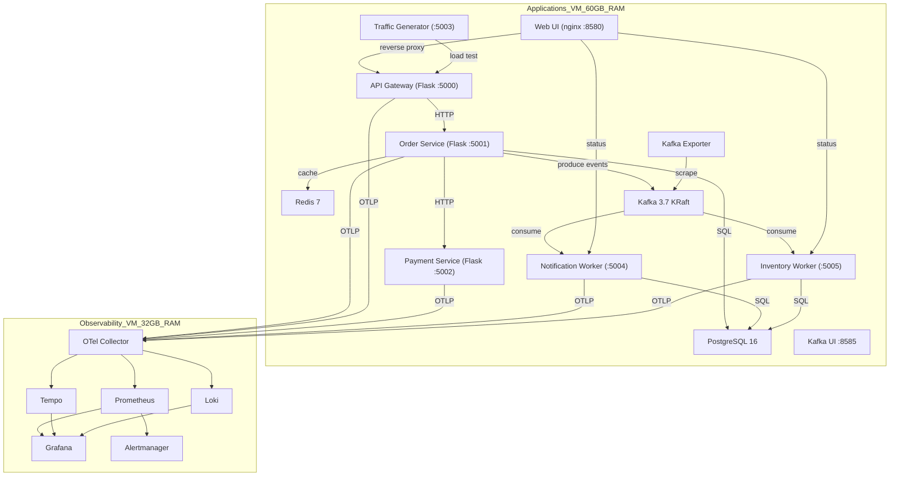

# System Architecture

```mermaid
graph TB

subgraph Applications_VM_60GB_RAM
    UI["Web UI (nginx :8580)"]
    GW["API Gateway (Flask :5000)"]
    OS["Order Service (Flask :5001)"]
    PS["Payment Service (Flask :5002)"]
    TG["Traffic Generator (:5003)"]
    NW["Notification Worker (:5004)"]
    IW["Inventory Worker (:5005)"]
    PG["PostgreSQL 16"]
    RD["Redis 7"]
    KF["Kafka 3.7 KRaft"]
    KE["Kafka Exporter"]
    KUI["Kafka UI :8585"]
end

subgraph Observability_VM_32GB_RAM
    OTEL["OTel Collector"]
    PROM["Prometheus"]
    GRAF["Grafana"]
    TEMPO["Tempo"]
    LOKI["Loki"]
    AM["Alertmanager"]
end

UI -->|reverse proxy| GW
GW -->|HTTP| OS
OS -->|HTTP| PS

OS -->|SQL| PG
OS -->|cache| RD
OS -->|produce events| KF

KF -->|consume| NW
KF -->|consume| IW

NW -->|SQL| PG
IW -->|SQL| PG

TG -->|load test| GW

UI -->|status| NW
UI -->|status| IW

KE -->|scrape| KF

OS -->|OTLP| OTEL
GW -->|OTLP| OTEL
PS -->|OTLP| OTEL
NW -->|OTLP| OTEL
IW -->|OTLP| OTEL

OTEL --> PROM
OTEL --> TEMPO
OTEL --> LOKI

PROM --> GRAF
TEMPO --> GRAF
LOKI --> GRAF

PROM --> AM
```
