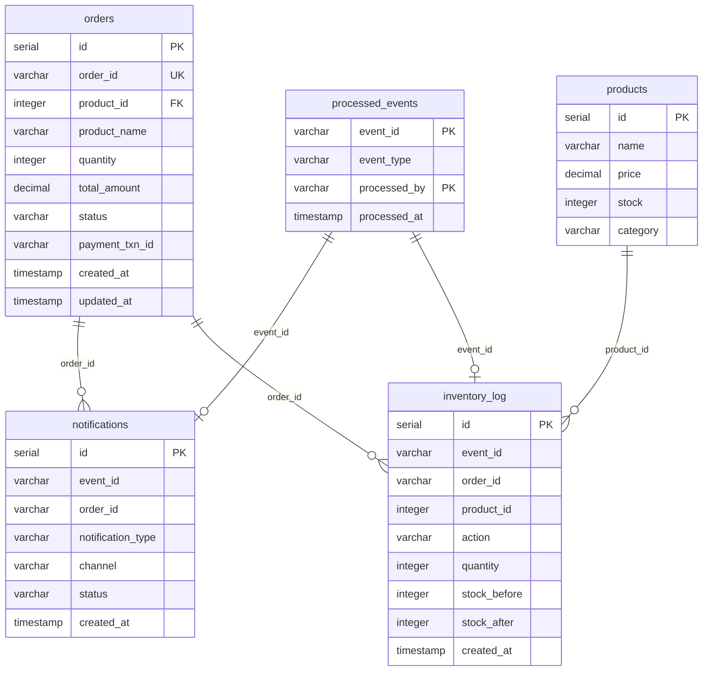

# 🏗️ Observability Lab — Architecture Overview

> E-commerce microservices platform with event-driven architecture, full observability stack, and Kafka event streaming.

---

## System Architecture

```
                          ┌─────────────────────────────────────────────────────────────────┐
                          │                    Applications VM (192.168.100.57)              │
                          │                                                                  │
                          │  ┌──────────┐     ┌──────────────┐     ┌─────────────────┐       │
  Users ─────────────────►│  │  Web UI  │────►│ API Gateway  │────►│  Order Service  │       │
          HTTP :8580      │  │  (nginx) │     │  Flask :5000 │     │  Flask :5001    │       │
                          │  └──────────┘     └──────────────┘     └────────┬────────┘       │
                          │       │                                    │    │    │            │
                          │       │                                    │    │    │            │
                          │       │               ┌────────────────────┘    │    │            │
                          │       │               │                        │    │            │
                          │       │         ┌─────▼──────┐          ┌──────▼──┐ │            │
                          │       │         │ PostgreSQL  │          │  Redis  │ │            │
                          │       │         │    :5432    │          │  :6379  │ │            │
                          │       │         └─────▲──────┘          └─────────┘ │            │
                          │       │               │                             │            │
                          │       │               │    ┌────────────────────────┘            │
                          │       │               │    │  Kafka produce                      │
                          │       │               │    ▼                                     │
                          │       │               │  ┌─────────────┐  ┌───────────────┐      │
                          │       │               │  │    Kafka    │  │ Kafka Exporter│      │
                          │       │               │  │ KRaft :9092 │  │    :9308      │      │
                          │       │               │  └──────┬──────┘  └───────────────┘      │
                          │       │               │         │                                │
                          │       │               │    ┌────┴────┐                           │
                          │       │               │    │ consume │                           │
                          │       │               │    ▼         ▼                           │
                          │  ┌────▼────┐    ┌─────┴────────┐ ┌──────────────┐                │
                          │  │ Notif.  │    │  Notification │ │  Inventory   │                │
                          │  │ Status  │◄───│    Worker     │ │   Worker     │                │
                          │  │ Inv.Log │    │    :5004      │ │   :5005      │                │
                          │  └─────────┘    └──────────────┘ └──────────────┘                │
                          │                                                                  │
                          │  ┌──────────────┐  ┌──────────────┐  ┌──────────────┐            │
                          │  │Payment Svc   │  │Traffic Gen   │  │  Kafka UI    │            │
                          │  │  :5002       │  │  :5003       │  │   :8585      │            │
                          │  └──────────────┘  └──────────────┘  └──────────────┘            │
                          └──────────────────────────────┬──────────────────────────────────┘
                                                         │ OTLP (gRPC :4317)
                          ┌──────────────────────────────▼──────────────────────────────────┐
                          │                  Observability VM (192.168.100.55)               │
                          │                                                                  │
                          │  ┌────────────────┐  ┌────────────┐  ┌───────────────┐           │
                          │  │ OTel Collector │─►│ Prometheus │─►│  Grafana      │           │
                          │  │  :4317/:4318   │  │   :9090    │  │   :3000       │           │
                          │  │                │  └────────────┘  └───────────────┘           │
                          │  │                │─►┌────────────┐                              │
                          │  │                │  │   Tempo     │                              │
                          │  │                │  │   :3200     │                              │
                          │  │                │  └────────────┘                              │
                          │  │                │─►┌────────────┐  ┌───────────────┐           │
                          │  │                │  │   Loki      │  │ Alertmanager  │           │
                          │  └────────────────┘  │   :3100     │  │  → Telegram   │           │
                          │                      └────────────┘  └───────────────┘           │
                          └──────────────────────────────────────────────────────────────────┘
```

---

## Services

### Infrastructure

| Service | Image | Port | Description |
|---|---|---|---|
| **PostgreSQL** | `postgres:16-alpine` | 5432 | Primary database — orders, products, events, notifications, inventory |
| **Redis** | `redis:7-alpine` | 6379 | Cache layer — product catalog (TTL 60s) |
| **Kafka** | `apache/kafka:3.7.0` | 9092 | Event streaming platform — KRaft mode (no ZooKeeper) |
| **Kafka Exporter** | `danielqsj/kafka-exporter` | 9308 | Exports Kafka metrics → Prometheus |
| **Kafka UI** | `provectuslabs/kafka-ui` | 8585 | Web UI for Kafka topic/consumer inspection |

### Application Services

| Service | Port | Description |
|---|---|---|
| **Web UI** | 8580 | Nginx SPA — dashboard, orders, events, load testing |
| **API Gateway** | 5000 | BFF pattern — routes, aggregates, error propagation |
| **Order Service** | 5001 | Create orders, manage payments, publish Kafka events |
| **Payment Service** | 5002 | Simulated payment processing with configurable latency/errors |
| **Traffic Generator** | 5003 | Load testing tool with scenario templates (flash sale, pipeline) |
| **Notification Worker** | 5004 | Kafka consumer — processes order events → sends notifications |
| **Inventory Worker** | 5005 | Kafka consumer — processes order events → manages stock |

### Observability Stack (Separate VM)

| Tool | Port | Description |
|---|---|---|
| **OTel Collector** | 4317/4318 | Receives OTLP traces/metrics/logs, routes to backends |
| **Prometheus** | 9090 | Metrics storage, PromQL, recording rules, alerting rules |
| **Grafana** | 3000 | Dashboards — application health, Kafka, workers |
| **Tempo** | 3200 | Distributed tracing backend |
| **Loki** | 3100 | Log aggregation with LogQL |
| **Alertmanager** | 9093 | Alert routing → Telegram |

---

## Data Flow

### Synchronous (HTTP Request Path)
```
Web UI → API Gateway → Order Service → Payment Service
                              ↕              
                         PostgreSQL     
                              ↕              
                           Redis (cache)
```

### Asynchronous (Event-Driven Path)
```
Order Service ──publish──► Kafka (topic: order.events)
                               │
                    ┌──────────┴──────────┐
                    ▼                     ▼
           Notification Worker     Inventory Worker
           (group: notif-workers)  (group: inv-workers)
                    │                     │
                    ▼                     ▼
              notifications         inventory_log
              (PostgreSQL)          (PostgreSQL)
```

### Kafka Event Types

| Event | Trigger | Consumed By |
|---|---|---|
| `order.created` | New order saved | Notification Worker, Inventory Worker |
| `order.payment_completed` | Payment success | Notification Worker |
| `order.payment_failed` | Payment rejected | Notification Worker, Inventory Worker |

### Telemetry Pipeline
```
All Services ──OTLP gRPC──► OTel Collector ──► Prometheus (metrics)
                                            ──► Tempo (traces)
                                            ──► Loki (logs)
                                            ──► Grafana (dashboards)
```

---

## Database Schema



---

## Design Patterns

### 1. Event-Driven Architecture
Order Service publishes events to Kafka after completing operations. Workers consume events independently, enabling loose coupling and horizontal scaling.

### 2. Idempotent Processing
Workers track processed events in `processed_events` table using composite key `(event_id, processed_by)`. Prevents duplicate processing on Kafka redelivery.

### 3. Cache-Aside (Redis)
Product catalog is cached in Redis with 60s TTL. Order Service checks cache first, falls back to PostgreSQL on cache miss, then populates cache.

### 4. Pessimistic Locking (Inventory)
```sql
SELECT stock FROM products WHERE id = %s FOR UPDATE;  -- Acquire row lock
UPDATE products SET stock = %s WHERE id = %s;          -- Update stock
INSERT INTO inventory_log (...);                       -- Audit trail
COMMIT;                                                -- Release lock
```

### 5. Distributed Trace Propagation
Trace context (W3C `traceparent`) is injected into Kafka message headers by producers and extracted by consumers, enabling end-to-end distributed tracing across async boundaries.

### 6. Backend for Frontend (BFF)
API Gateway aggregates calls to backend services and handles error propagation, providing a unified API for the Web UI.

---

## Environment Variables

| Variable | Used By | Description |
|---|---|---|
| `OTEL_EXPORTER_OTLP_ENDPOINT` | All services | OTel Collector endpoint (Observability VM) |
| `DATABASE_URL` | Order, Notification, Inventory | PostgreSQL connection string |
| `REDIS_URL` | Order Service | Redis connection string |
| `KAFKA_BOOTSTRAP_SERVERS` | Order, Notification, Inventory | Kafka broker address |
| `ORDER_SERVICE_URL` | API Gateway | Order Service endpoint |
| `PAYMENT_SERVICE_URL` | Order Service | Payment Service endpoint |

---

## Ports Summary

| Port | Service | Protocol |
|---|---|---|
| 5000 | API Gateway | HTTP |
| 5001 | Order Service | HTTP |
| 5002 | Payment Service | HTTP |
| 5003 | Traffic Generator | HTTP |
| 5004 | Notification Worker | HTTP |
| 5005 | Inventory Worker | HTTP |
| 5432 | PostgreSQL | TCP |
| 6379 | Redis | TCP |
| 8580 | Web UI | HTTP |
| 8585 | Kafka UI | HTTP |
| 9092 | Kafka | TCP |
| 9308 | Kafka Exporter | HTTP |

---

## Quick Start

```bash
# 1. Create network (if not exists)
docker network create observability

# 2. Start all services
cd applications-vm/applications
docker compose up -d --build

# 3. Verify health
docker compose ps

# 4. Access
#    Web UI:   http://<VM_IP>:8580
#    Kafka UI: http://<VM_IP>:8585
```

---

## Repository Structure

```
observability-lab/
├── ARCHITECTURE.md              ← Mermaid architecture diagram
├── ARCHITECTURE_DETAIL.md       ← This file (detailed documentation)
├── applications-vm/
│   └── applications/
│       ├── docker-compose.yml   ← 11-service orchestration
│       ├── init.sql             ← Database schema + seed data
│       ├── api-gateway/         ← BFF routing service
│       ├── order-service/       ← Core business logic + Kafka producer
│       ├── payment-service/     ← Simulated payment processing
│       ├── notification-worker/ ← Kafka consumer → notifications
│       ├── inventory-worker/    ← Kafka consumer → stock management
│       ├── traffic-gen/         ← Load testing scenarios
│       ├── web-ui/              ← Nginx SPA dashboard
│       └── sample-app/          ← Reference application
│
└── observability-vm/
    ├── phase1-metrics/          ← Prometheus, Grafana, Node Exporter
    ├── phase2-logging/          ← Loki, Promtail
    ├── phase3-tracing/          ← Tempo, OTel Collector
    ├── scripts/                 ← Utility scripts
    └── storage/                 ← Persistent data
```
