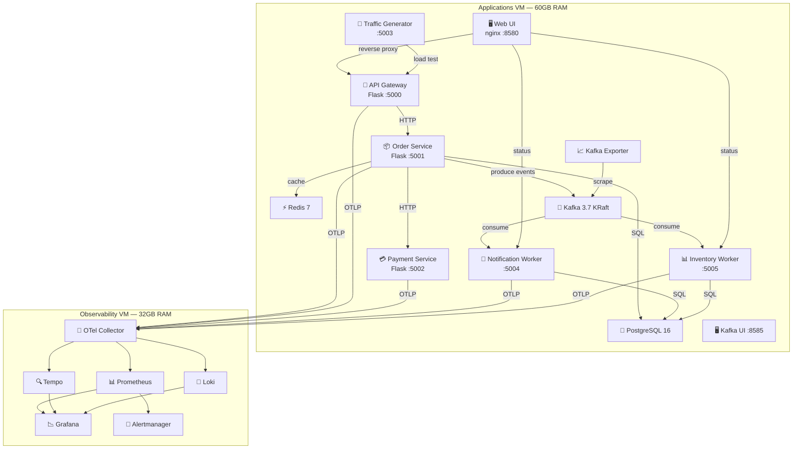

# 🏗️ Tổng Kết Kiến Trúc & Kiến Thức DevOps

## 1. Kiến Trúc Tổng Quan



---

## 2. Các Thành Phần Đã Triển Khai

### 🔵 Infrastructure Layer

| Thành phần | Vai trò | Kiến thức DevOps |
|---|---|---|
| **PostgreSQL 16** | Persistent storage cho orders, products, notifications, inventory log | Database management, schema migration, connection pooling |
| **Redis 7** | Cache-aside pattern cho product catalog (TTL 60s) | Caching strategy, cache invalidation, TTL management |
| **Kafka 3.7 (KRaft)** | Event streaming giữa services | Message broker, async processing, topic management |
| **Docker Compose** | Container orchestration (11 services) | Container networking, health checks, dependency ordering |

### 🟢 Application Layer

| Service | Pattern | Kiến thức |
|---|---|---|
| **Web UI** | Nginx reverse proxy + SPA | Reverse proxy, CORS avoidance, static file serving |
| **API Gateway** | BFF (Backend for Frontend) | API aggregation, error propagation, request routing |
| **Order Service** | Kafka Producer + DB + Cache | Event publishing, trace context injection, cache-aside |
| **Payment Service** | Simulated payment processing | Latency simulation, error rate injection |
| **Notification Worker** | Kafka Consumer → notifications | Idempotency, consumer groups, event processing |
| **Inventory Worker** | Kafka Consumer → stock management | Pessimistic locking (`FOR UPDATE`), audit logging |
| **Traffic Generator** | Load testing tool | Scenario-based testing, concurrent request generation |

### 🟡 Observability Layer

| Tool | Chức năng | Kiến thức |
|---|---|---|
| **OTel Collector** | Nhận OTLP traces/metrics/logs, route tới backends | Telemetry pipeline, data routing |
| **Prometheus** | Metrics storage + PromQL | Recording rules, scrape config, alerting rules |
| **Grafana** | Dashboards + visualization | Dashboard provisioning, data source configuration |
| **Tempo** | Distributed tracing backend | Trace storage, span search, service map |
| **Loki** | Log aggregation | LogQL, structured logging, label extraction |
| **Alertmanager** | Alert routing + Telegram | Alert grouping, receiver config, silence |

---

## 3. Design Patterns Đã Ứng Dụng

### 🔷 Event-Driven Architecture
```
Order Service → Kafka → [Notification Worker, Inventory Worker]
```
- **Loose coupling**: Order service không cần biết về notification hay inventory logic
- **Scalability**: Mỗi consumer group có thể scale độc lập
- **Resilience**: Nếu worker down, message vẫn nằm trong Kafka chờ xử lý

### 🔷 Idempotency Pattern
```sql
-- Mỗi worker check trước khi xử lý:
SELECT 1 FROM processed_events WHERE event_id = %s AND processed_by = %s
-- Sau khi xử lý xong:
INSERT INTO processed_events (event_id, event_type, processed_by) VALUES (...)
```
- Đảm bảo mỗi event chỉ được xử lý **một lần duy nhất** dù consumer restart
- Tránh duplicate notifications và stock deduction

### 🔷 Cache-Aside Pattern (Redis)
```
1. Check Redis cache first
2. Cache miss → Query PostgreSQL
3. Store result in Redis (TTL 60s)
4. Return data
```
- Giảm load lên database
- Custom metrics: `cache_hit_total`, `cache_miss_total`

### 🔷 Distributed Tracing Propagation
```
Order Service → inject trace context vào Kafka headers
                → Workers extract context → continue trace
```
- **End-to-end visibility**: Trace từ HTTP request → Kafka → worker processing
- W3C TraceContext format qua Kafka message headers

### 🔷 Reverse Proxy Pattern (Nginx)
```
/api/*            → api-gateway:5000
/notifications/*  → notification-worker:5004
/inventory/*      → inventory-worker:5005
/traffic/*        → traffic-gen:5003
```
- Tránh CORS issues
- Single entry point cho Web UI

### 🔷 Pessimistic Locking (Inventory)
```sql
SELECT stock FROM products WHERE id = %s FOR UPDATE  -- Lock row
UPDATE products SET stock = %s WHERE id = %s         -- Update
INSERT INTO inventory_log (...)                       -- Audit trail
COMMIT                                                -- Release lock
```
- Tránh race condition khi nhiều workers update stock cùng lúc

---

## 4. Kiến Thức DevOps Đã Học & Ứng Dụng

### 📊 Observability (6 Phases)

| Phase | Chủ đề | Ứng dụng thực tế |
|---|---|---|
| **Phase 1** | Metrics Foundation | Prometheus, Grafana, Node Exporter, cAdvisor |
| **Phase 2** | Logging | Loki, structured JSON logging, LogQL |
| **Phase 3** | Distributed Tracing | Tempo, OTel Collector, trace-to-log correlation |
| **Phase 4** | Alerting | Alertmanager, Recording Rules, Telegram integration, `predict_linear()` |
| **Phase 5** | App Instrumentation | Custom metrics (Counter, Histogram), manual spans, OTel SDK |
| **Phase 6** | Correlation & SLO | Metrics↔Logs↔Traces correlation, SLI/SLO monitoring |

### 🐳 Containerization & Orchestration

| Skill | Chi tiết |
|---|---|
| **Docker Compose** | Multi-service orchestration, `depends_on` + `condition`, health checks |
| **Health Checks** | `pg_isready`, `redis-cli ping`, Kafka broker API check |
| **Networking** | Docker external network, DNS resolution giữa containers |
| **Volume Management** | Data persistence cho PostgreSQL, Kafka |
| **Image Building** | Multi-stage builds, dependency management |

### 📡 Message Streaming (Kafka)

| Skill | Chi tiết |
|---|---|
| **KRaft Mode** | Kafka không cần ZooKeeper, đơn giản hơn cho triển khai |
| **Topic Design** | Key-based partitioning (`order_id`), 3 partitions |
| **Consumer Groups** | `notification-workers`, `inventory-workers` — mỗi nhóm độc lập |
| **Monitoring** | kafka-exporter → Prometheus, consumer lag tracking |
| **Kafka UI** | provectuslabs/kafka-ui cho topic browsing, message inspection |

### 🔍 Debugging & Troubleshooting

| Tình huống | Kỹ năng đã áp dụng |
|---|---|
| "Unknown error" khi tạo order | Trace API response format qua các layers (UI → Gateway → Service) |
| Events tab trống | So sánh API response fields vs UI expectations (contract mismatch) |
| Worker DB errors | Xác định [init.sql](file:///root/workspace/observability-lab/applications-vm/init.sql) chỉ chạy 1 lần khi tạo volume mới |
| Kafka topic không tạo | Hiểu auto-create chỉ khi producer gửi message thành công |
| `_consumer_offsets` only | Debug flow ngược từ consumer → producer → service logic |

### 🛡️ Reliability Patterns

| Pattern | Ứng dụng |
|---|---|
| **Idempotent Processing** | `processed_events` table, check trước khi xử lý |
| **Graceful Degradation** | Kafka publish failure không block order creation |
| **Retry Logic** | Kafka producer `retries: 3`, `retry.backoff.ms: 100` |
| **Audit Trail** | [inventory_log](file:///root/workspace/observability-lab/applications-vm/applications/inventory-worker/app.py#511-535) table ghi lại mọi thay đổi stock |
| **Health Endpoints** | Mỗi service có `/health` và `/status` |

---

## 5. Monitoring & Alerting Đã Cấu Hình

### Prometheus Scrape Targets
- `kafka-exporter:9308` — Kafka broker metrics
- OTel Collector → forward metrics từ tất cả services

### Alert Rules (Kafka)
- `KafkaConsumerLagHigh` — Consumer lag > 100 trong 5 phút
- `KafkaTopicUnderReplicated` — Partitions bị under-replicated
- `KafkaConsumerGroupDown` — Consumer group inactive

### Grafana Dashboards
- **Kafka Overview**: Topic throughput, consumer lag, partition distribution
- **Worker Performance**: Processing rate, errors, duration histograms
- **Application Health**: Service status, request rates, error rates

---

## 6. Tổng Kết Kiến Trúc Theo DevOps Mindset

```
┌─────────────────────────────────────────────────────────────┐
│                    CI/CD & Deployment                        │
│  Docker Compose → Build → Deploy → Health Check → Monitor   │
├─────────────────────────────────────────────────────────────┤
│                    Observability Stack                       │
│  Metrics (Prometheus) + Logs (Loki) + Traces (Tempo)        │
│  → Correlation → Dashboards (Grafana) → Alerts (Telegram)  │
├─────────────────────────────────────────────────────────────┤
│                    Application Layer                         │
│  API Gateway → Order → Payment (sync HTTP)                  │
│  Order → Kafka → Workers (async event-driven)               │
│  OTel SDK instrumentation cho tất cả services               │
├─────────────────────────────────────────────────────────────┤
│                    Data Layer                                │
│  PostgreSQL (persistence) + Redis (cache) + Kafka (events)  │
└─────────────────────────────────────────────────────────────┘
```

> [!TIP]
> **Bài học quan trọng nhất**: Observability không chỉ là "xem metrics" — mà là khả năng **trace một request từ đầu đến cuối** qua toàn bộ hệ thống (HTTP → Kafka → Worker → Database), kết hợp 3 tín hiệu (Metrics + Logs + Traces) để **debug nhanh hơn** và **phát hiện vấn đề trước khi user bị ảnh hưởng**.
