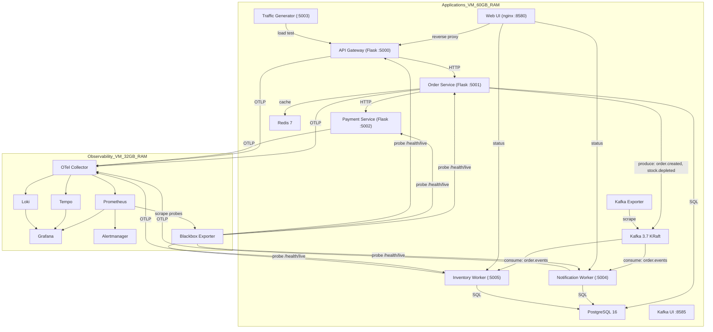
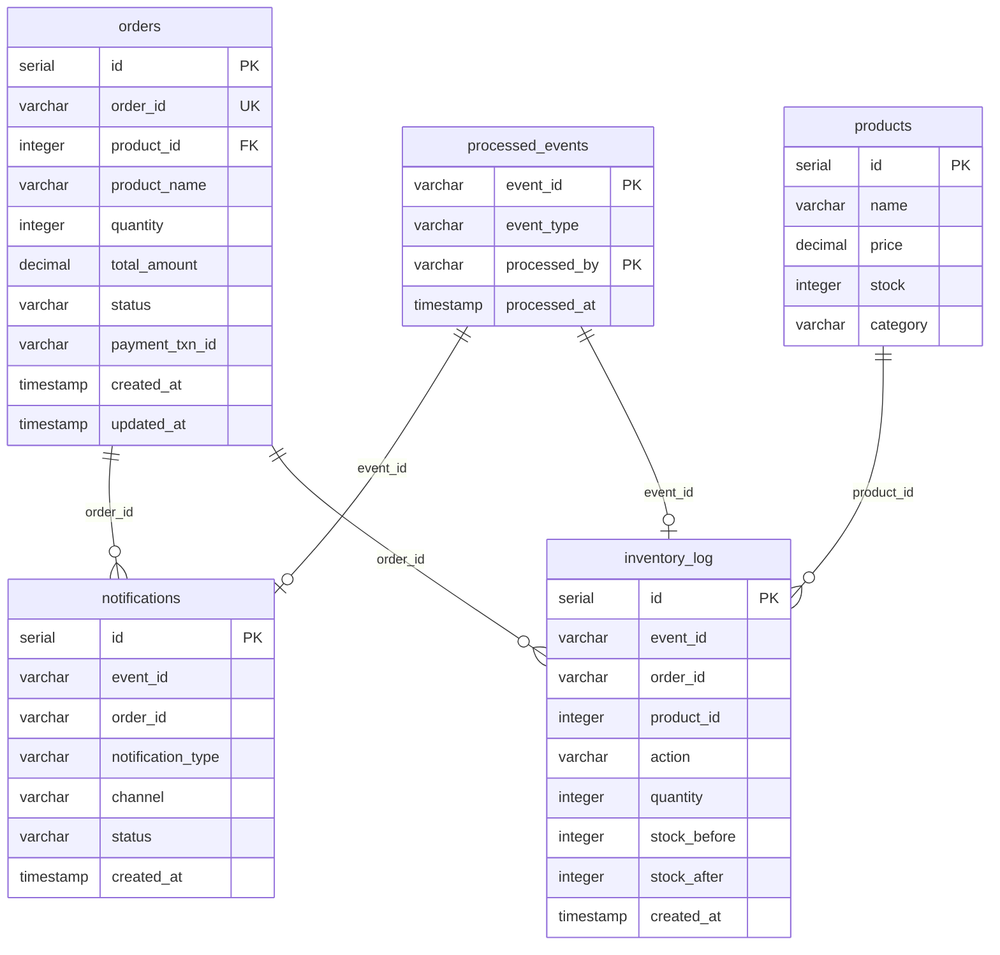

# 🏗️ Observability Lab — Architecture

> E-commerce microservices platform with event-driven architecture, full observability stack, and Kafka event streaming.

---

## System Architecture



---

## Services

### Infrastructure

| Service | Image | Port | Description |
|---|---|---|---|
| **PostgreSQL** | `postgres:16-alpine` | 5432 | Primary database — orders, products, events, notifications, inventory |
| **Redis** | `redis:7-alpine` | 6379 | Cache layer — product catalog (TTL 60s) |
| **Kafka** | `apache/kafka:3.7.0` | 9092 | Event streaming platform — KRaft mode (no ZooKeeper) |
| **Kafka Exporter** | `danielqsj/kafka-exporter` | 9308 | Exports Kafka metrics → Prometheus |
| **Kafka UI** | `provectuslabs/kafka-ui` | 8585 | Web UI for Kafka topic/consumer inspection |

### Application Services

| Service | Port | Description |
|---|---|---|
| **Web UI** | 8580 | Nginx SPA — dashboard, orders, events, load testing |
| **API Gateway** | 5000 | BFF pattern — routes, aggregates, error propagation |
| **Order Service** | 5001 | Create orders, manage payments, publish Kafka events |
| **Payment Service** | 5002 | Simulated payment processing with configurable latency/errors |
| **Traffic Generator** | 5003 | Load testing tool with scenario templates (flash sale, pipeline) |
| **Notification Worker** | 5004 | Kafka consumer — processes order events → sends notifications |
| **Inventory Worker** | 5005 | Kafka consumer — processes order events → manages stock |

### Observability Stack (Separate VM)

| Tool | Port | Description |
|---|---|---|
| **OTel Collector** | 4317/4318 | Receives OTLP traces/metrics/logs, routes to backends |
| **Prometheus** | 9090 | Metrics storage, PromQL, recording rules, alerting rules |
| **Grafana** | 3000 | Dashboards — application health, Kafka, workers, SLO |
| **Tempo** | 3200 | Distributed tracing backend |
| **Loki** | 3100 | Log aggregation with LogQL |
| **Alertmanager** | 9093 | Alert routing → Telegram |
| **Blackbox Exporter** | 9115 | Active probing — HTTP health checks to service `/health/live` endpoints |

---

## Data Flow

### Synchronous (HTTP Request Path)
```
Web UI → API Gateway → Order Service → Payment Service
                              ↕              
                         PostgreSQL     
                              ↕              
                           Redis (cache)
```

### Asynchronous (Event-Driven Path)
```
Order Service ──publish──► Kafka (topic: order.events)
                               │
                    ┌──────────┴──────────┐
                    ▼                     ▼
           Notification Worker     Inventory Worker
           (group: notif-workers)  (group: inv-workers)
                    │                     │
                    ▼                     ▼
              notifications         inventory_log
              (PostgreSQL)          (PostgreSQL)
```

### Kafka Event Types

| Event | Trigger | Consumed By |
|---|---|---|
| `order.created` | New order saved | Notification Worker, Inventory Worker |
| `order.payment_completed` | Payment success | Notification Worker |
| `order.payment_failed` | Payment rejected | Notification Worker, Inventory Worker |
| `stock.depleted` | Stock insufficient (< threshold) | Inventory Worker (triggers auto-restock) |

### Telemetry Pipeline
```
All Services ──OTLP gRPC──► OTel Collector ──► Prometheus (metrics)
                                            ──► Tempo (traces)
                                            ──► Loki (logs)
                                            ──► Grafana (dashboards)

Blackbox Exporter ──probe /health/live──► Application Services
Prometheus ──scrape──► Blackbox Exporter (probe results)
```

---

## Database Schema



---

## Design Patterns

### 1. Event-Driven Architecture
Order Service publishes events to Kafka after completing operations. Workers consume events independently, enabling loose coupling and horizontal scaling.
```
Order Service → Kafka → [Notification Worker, Inventory Worker]
```
- **Loose coupling**: Order service không cần biết về notification hay inventory logic
- **Scalability**: Mỗi consumer group có thể scale độc lập
- **Resilience**: Nếu worker down, message vẫn nằm trong Kafka chờ xử lý

### 2. Idempotent Processing
Workers track processed events in `processed_events` table using composite key `(event_id, processed_by)`. Prevents duplicate processing on Kafka redelivery.
```sql
-- Check before processing:
SELECT 1 FROM processed_events WHERE event_id = %s AND processed_by = %s
-- After processing:
INSERT INTO processed_events (event_id, event_type, processed_by) VALUES (...)
```

### 3. Cache-Aside (Redis)
Product catalog is cached in Redis with 60s TTL. Order Service checks cache first, falls back to PostgreSQL on cache miss, then populates cache.
- Custom metrics: `cache_hit_total`, `cache_miss_total`

### 4. Pessimistic Locking (Inventory)
```sql
SELECT stock FROM products WHERE id = %s FOR UPDATE;  -- Acquire row lock
UPDATE products SET stock = %s WHERE id = %s;          -- Update stock
INSERT INTO inventory_log (...);                       -- Audit trail
COMMIT;                                                -- Release lock
```

### 5. Distributed Trace Propagation
Trace context (W3C `traceparent`) is injected into Kafka message headers by producers and extracted by consumers, enabling end-to-end distributed tracing across async boundaries.

### 6. Backend for Frontend (BFF)
API Gateway aggregates calls to backend services and handles error propagation, providing a unified API for the Web UI.
```
/api/*            → api-gateway:5000
/notifications/*  → notification-worker:5004
/inventory/*      → inventory-worker:5005
/traffic/*        → traffic-gen:5003
```

---

## Monitoring & Alerting

### Prometheus Scrape Targets
- `kafka-exporter:9308` — Kafka broker metrics
- OTel Collector → forward metrics từ tất cả services
- Blackbox Exporter → active health check probes

### Alert Rules

| Category | Rules | Description |
|---|---|---|
| **Kafka** | `KafkaConsumerLagHigh`, `KafkaTopicUnderReplicated`, `KafkaConsumerGroupDown` | Consumer lag, partition health, group status |
| **SLO Burn Rate** | `APIGateway*BurnRate`, `PaymentService*BurnRate` | Fast-burn (2m/15m) and slow-burn (30m/3h) windows |
| **Health Check** | `ServiceHealthCheckFailed` | Blackbox Exporter probe failure > 1 minute |
| **Predictive** | `DiskSpacePrediction`, `MemoryUsagePrediction` | `predict_linear()` based forecasting |

### Traffic Guards
- SLO burn rate alerts include `rate(total[5m]) > 0.1` condition
- Prevents **phantom alerts** when stale metrics persist after traffic stops
- Recording rules use `or vector(1)` fallback, but traffic guards are still needed for alert accuracy

### Grafana Dashboards
- **Alerting Overview**: Firing alerts, alert history
- **Unified Overview**: Cross-service RED metrics at a glance
- **App Performance**: Per-service request rate, error rate, latency (RED method)
- **SLO Overview**: Availability/Latency compliance, burn rate, error budget
- **Kafka Overview**: Topic throughput, consumer lag, partition distribution
- **Worker Performance**: Processing rate, errors, duration histograms
- **Infrastructure**: Node Exporter, cAdvisor, DB connections

---

## Environment Variables

| Variable | Used By | Description |
|---|---|---|
| `OTEL_EXPORTER_OTLP_ENDPOINT` | All services | OTel Collector endpoint (Observability VM) |
| `DATABASE_URL` | Order, Notification, Inventory | PostgreSQL connection string |
| `REDIS_URL` | Order Service | Redis connection string |
| `KAFKA_BOOTSTRAP_SERVERS` | Order, Notification, Inventory | Kafka broker address |
| `ORDER_SERVICE_URL` | API Gateway | Order Service endpoint |
| `PAYMENT_SERVICE_URL` | Order Service | Payment Service endpoint |

---

## Ports Summary

| Port | Service | Protocol |
|---|---|---|
| 5000 | API Gateway | HTTP |
| 5001 | Order Service | HTTP |
| 5002 | Payment Service | HTTP |
| 5003 | Traffic Generator | HTTP |
| 5004 | Notification Worker | HTTP |
| 5005 | Inventory Worker | HTTP |
| 5432 | PostgreSQL | TCP |
| 6379 | Redis | TCP |
| 8580 | Web UI | HTTP |
| 8585 | Kafka UI | HTTP |
| 9092 | Kafka | TCP |
| 9115 | Blackbox Exporter | HTTP |
| 9308 | Kafka Exporter | HTTP |

---

## DevOps Knowledge Applied

### Containerization & Orchestration

| Skill | Details |
|---|---|
| **Docker Compose** | Multi-service orchestration, `depends_on` + `condition`, health checks |
| **Health Checks** | `pg_isready`, `redis-cli ping`, Kafka broker API check |
| **Networking** | Docker external network, DNS resolution between containers |
| **Volume Management** | Data persistence for PostgreSQL, Kafka |

### Message Streaming (Kafka)

| Skill | Details |
|---|---|
| **KRaft Mode** | Kafka without ZooKeeper, simplified deployment |
| **Topic Design** | Key-based partitioning (`order_id`), 3 partitions |
| **Consumer Groups** | `notification-workers`, `inventory-workers` — independent consumption |
| **Monitoring** | kafka-exporter → Prometheus, consumer lag tracking |

### Reliability Patterns

| Pattern | Implementation |
|---|---|
| **Idempotent Processing** | `processed_events` table, check before processing |
| **Graceful Degradation** | Kafka publish failure does not block order creation |
| **Retry Logic** | Kafka producer `retries: 3`, `retry.backoff.ms: 100` |
| **Audit Trail** | `inventory_log` table records all stock changes |
| **Health Endpoints** | Each service exposes `/health/live` and `/status` |

### Debugging & Troubleshooting

| Scenario | Skills Applied |
|---|---|
| "Unknown error" on order creation | Trace API response format across layers (UI → Gateway → Service) |
| Events tab empty | Compare API response fields vs UI expectations (contract mismatch) |
| Worker DB errors | Understand `init.sql` only runs once when volume is first created |
| Kafka topic not created | Auto-create happens only when producer sends first message |
| Phantom alerts at night | Check traffic rate before investigating SLO burn rate alerts |

---

## Architecture Summary

```
┌─────────────────────────────────────────────────────────────┐
│                    CI/CD & Deployment                        │
│  Docker Compose → Build → Deploy → Health Check → Monitor   │
├─────────────────────────────────────────────────────────────┤
│                    Observability Stack                       │
│  Metrics (Prometheus) + Logs (Loki) + Traces (Tempo)        │
│  → Correlation → Dashboards (Grafana) → Alerts (Telegram)  │
├─────────────────────────────────────────────────────────────┤
│                    Application Layer                         │
│  API Gateway → Order → Payment (sync HTTP)                  │
│  Order → Kafka → Workers (async event-driven)               │
│  OTel SDK instrumentation for all services                  │
├─────────────────────────────────────────────────────────────┤
│                    Data Layer                                │
│  PostgreSQL (persistence) + Redis (cache) + Kafka (events)  │
└─────────────────────────────────────────────────────────────┘
```

> [!TIP]
> **Key takeaway**: Observability is not just "viewing metrics" — it's the ability to **trace a request end-to-end** through the entire system (HTTP → Kafka → Worker → Database), combining 3 signals (Metrics + Logs + Traces) to **debug faster** and **detect issues before users are impacted**.
