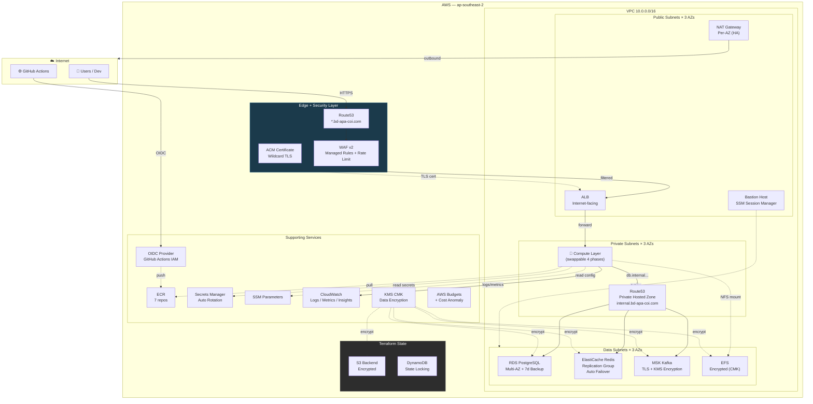
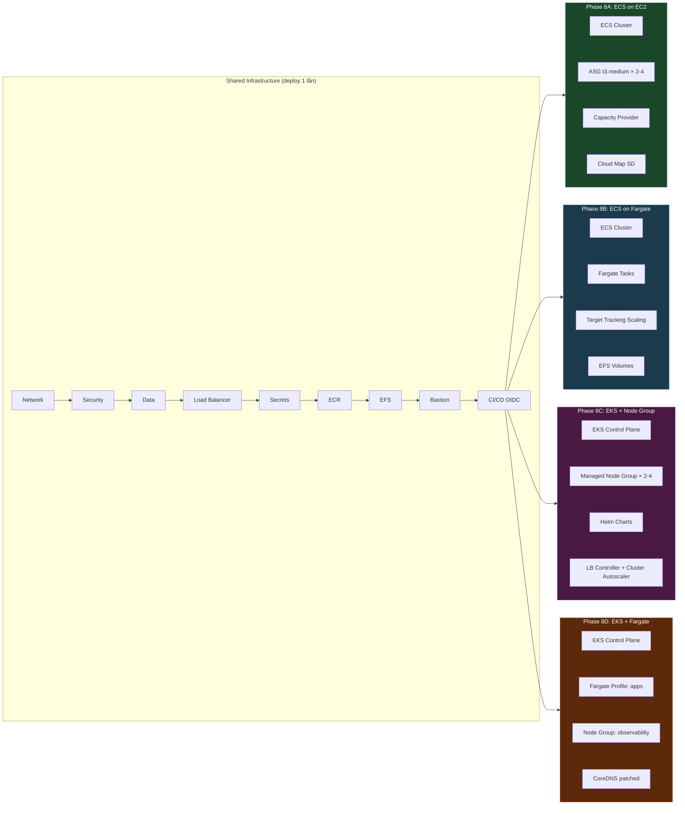
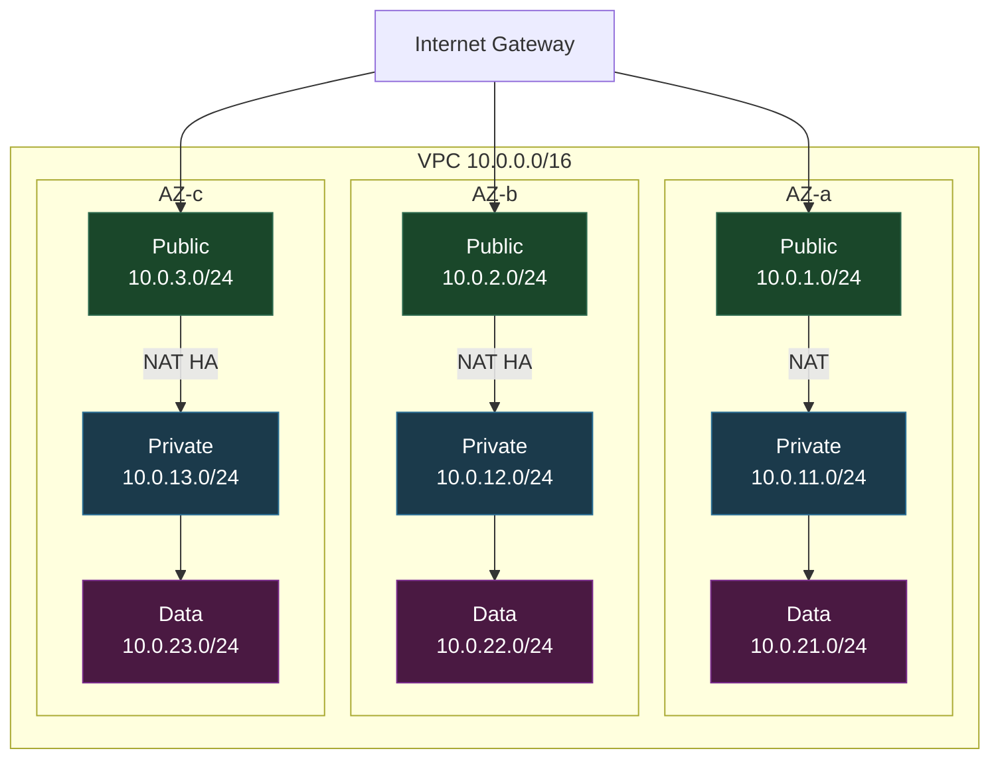
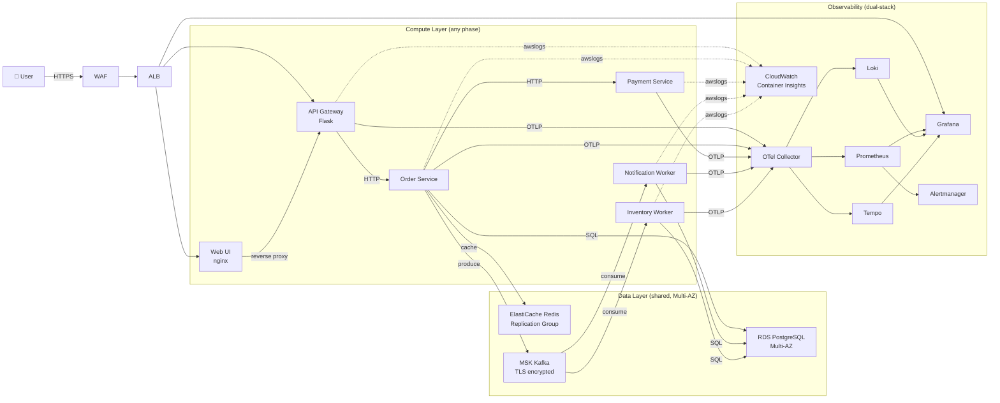
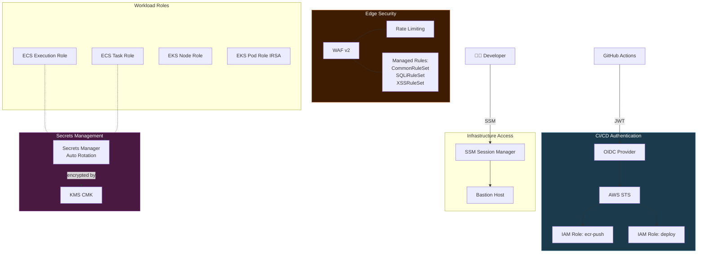
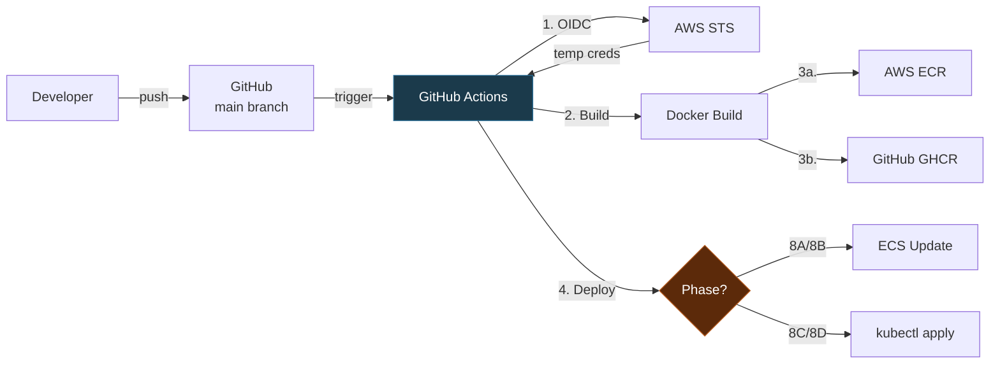

# AWS Architecture — Observability Lab

## 1. Production-Grade Architecture (Target)

---

## 2. Swappable Compute Layer — 4 Phases

---

## 3. Network Topology — 3 AZs × 3 Tiers

---

## 4. Application Data Flow

---

## 5. Security & Access Flow

---

## 6. CI/CD Pipeline

---

## Quick Reference

| Layer | Components | Subnet | Production Additions |
|-------|-----------|--------|---------------------|
| **Edge** | Route53, ACM, ALB | Public | + WAF v2, Rate Limiting |
| **Compute** | ECS/EKS (4 phases) | Private | (unchanged) |
| **Data** | RDS, Redis, MSK, EFS | Data | + Multi-AZ, Backup, KMS, TLS |
| **Observability** | Prometheus, Grafana, Loki, Tempo | Private | (unchanged) |
| **Management** | Bastion, SSM | Public | (unchanged) |
| **CI/CD** | OIDC, GitHub Actions | External | (already production-grade) |
| **State** | Terraform state | — | + S3 Backend, DynamoDB Lock |
| **Secrets** | SSM, Secrets Manager | — | + Auto Rotation, KMS |
