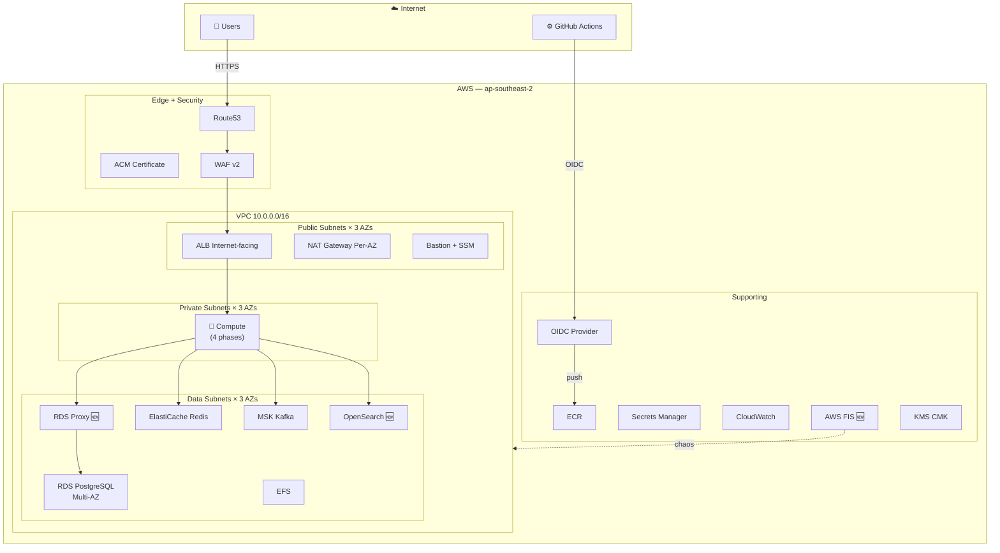
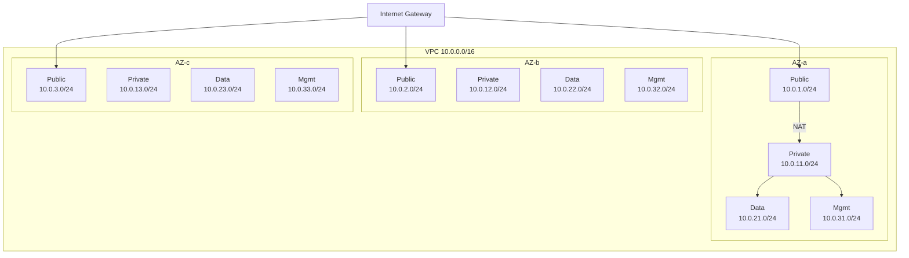
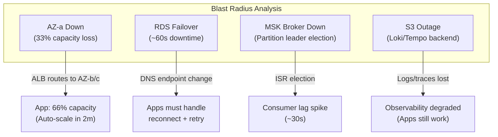
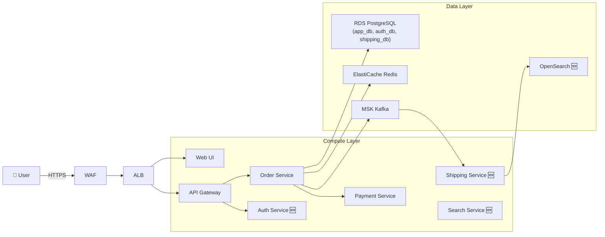
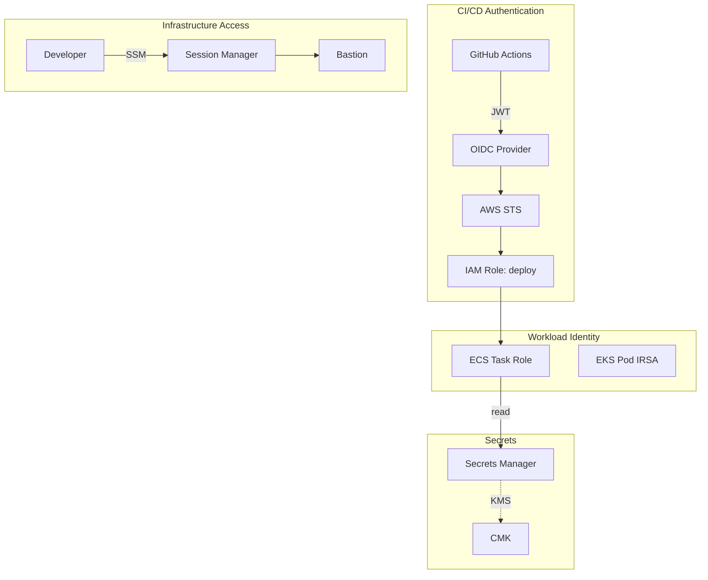
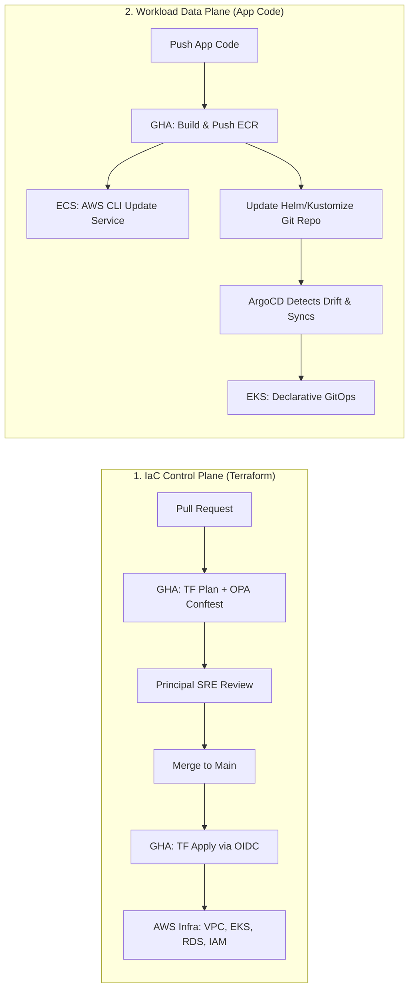

# 🏗️ AWS Architecture — Observability Lab

> **Blueprint của hệ thống trên AWS** — tập trung vào **Failure Domains**, **Blast Radius**, và **Trade-offs** so với On-Premises.

---

## 1. Service Mapping (On-Prem → AWS)

🆕 **Section mới** — giải thích "WHY" đằng sau mỗi quyết định.

| On-Prem (Docker Compose) | AWS Service | Why? | Trade-off / Learning |
|--------------------------|-------------|------|----------------------|
| PostgreSQL container | **RDS Multi-AZ** | Auto failover, backup, patching | Mất quyền tune `postgresql.conf`, cost cao hơn 3x |
| Redis container | **ElastiCache Replication Group** | Auto-failover < 30s | Không thể dùng Redis modules |
| Kafka KRaft single broker | **MSK (Managed Kafka)** | Không phải lo JVM tuning, partition rebalance | **$5/ngày** — phải destroy khi không dùng |
| PgBouncer (planned) | **RDS Proxy** 🆕 | Connection multiplexing, failover transparent | $0.015/conn-hour, chỉ support PostgreSQL/MySQL |
| MinIO (S3-compatible) | **Amazon S3 + Lifecycle** | 11 nines durability, Intelligent-Tiering | Data transfer cost khi cross-region |
| OpenSearch (planned) | **Amazon OpenSearch Service** 🆕 | Managed search, auto-scaling | ~$30/tháng cho t3.small × 2 |
| Grafana/Prometheus self-host | **AMP + AMG** (optional) | Managed, không phải scale storage | Mất quyền customize Prometheus rules |
| Local chaos (`docker stop`) | **AWS FIS** 🆕 | AZ failure, network partition, S3 outage | Cần IAM permissions cẩn thận |
| Docker secrets | **Secrets Manager + KMS** | Auto rotation, audit trail | $0.40/secret/month + API calls |

---

## 2. Production-Grade Architecture (Target)


```mermaid
graph TB
    subgraph INTERNET["☁️ Internet"]
        USER["👤 Users"]
        GHA["⚙️ GitHub Actions"]
    end

    subgraph AWS["AWS — ap-southeast-2"]
        subgraph EDGE["Edge + Security"]
            R53["Route53"]
            ACM["ACM Certificate"]
            WAF["WAF v2"]
        end

        subgraph VPC["VPC 10.0.0.0/16"]
            subgraph PUB["Public Subnets × 3 AZs"]
                ALB["ALB Internet-facing"]
                NAT["NAT Gateway Per-AZ"]
                BAST["Bastion + SSM"]
            end

            subgraph PRIV["Private Subnets × 3 AZs"]
                COMPUTE["🔄 Compute<br/>(4 phases)"]
            end

            subgraph DATA["Data Subnets × 3 AZs"]
                RDS["RDS PostgreSQL<br/>Multi-AZ"]
                RDS_PROXY["RDS Proxy 🆕"]
                REDIS["ElastiCache Redis"]
                MSK["MSK Kafka"]
                OS["OpenSearch 🆕"]
                EFS["EFS"]
            end
        end

        subgraph SUPPORT["Supporting"]
            ECR["ECR"]
            SM["Secrets Manager"]
            CW["CloudWatch"]
            FIS["AWS FIS 🆕"]
            OIDC["OIDC Provider"]
            KMS["KMS CMK"]
        end
    end

    USER -->|HTTPS| R53 --> WAF --> ALB --> COMPUTE
    COMPUTE --> RDS_PROXY --> RDS
    COMPUTE --> REDIS
    COMPUTE --> MSK
    COMPUTE --> OS
    GHA -->|OIDC| OIDC
    OIDC -->|push| ECR
    FIS -.->|chaos| VPC
```

---

## 3. Network Topology — 3 AZs × 4 Tiers


```mermaid
graph TB
    IGW["Internet Gateway"]

    subgraph VPC["VPC 10.0.0.0/16"]
        subgraph AZ_A["AZ-a"]
            PUB_A["Public<br/>10.0.1.0/24"]
            PRIV_A["Private<br/>10.0.11.0/24"]
            DATA_A["Data<br/>10.0.21.0/24"]
            MGMT_A["Mgmt<br/>10.0.31.0/24"]
        end

        subgraph AZ_B["AZ-b"]
            PUB_B["Public<br/>10.0.2.0/24"]
            PRIV_B["Private<br/>10.0.12.0/24"]
            DATA_B["Data<br/>10.0.22.0/24"]
            MGMT_B["Mgmt<br/>10.0.32.0/24"]
        end

        subgraph AZ_C["AZ-c"]
            PUB_C["Public<br/>10.0.3.0/24"]
            PRIV_C["Private<br/>10.0.13.0/24"]
            DATA_C["Data<br/>10.0.23.0/24"]
            MGMT_C["Mgmt<br/>10.0.33.0/24"]
        end
    end

    IGW --> PUB_A & PUB_B & PUB_C
    PUB_A -->|NAT| PRIV_A
    PRIV_A --> DATA_A
    PRIV_A --> MGMT_A
```

---

## 4. Failure Domains & Blast Radius 🆕

🆕 **Section mới** — Critical cho SRE mindset.


```mermaid
graph TB
    subgraph "Blast Radius Analysis"
        AZ_A_FAIL["AZ-a Down<br/>(33% capacity loss)"]
        RDS_FAILOVER["RDS Failover<br/>(~60s downtime)"]
        MSK_BROKER["MSK Broker Down<br/>(Partition leader election)"]
        S3_OUTAGE["S3 Outage<br/>(Loki/Tempo backend)"]
    end

    AZ_A_FAIL -->|"ALB routes to AZ-b/c"| APP_HEALTHY["App: 66% capacity<br/>(Auto-scale in 2m)"]
    RDS_FAILOVER -->|"DNS endpoint change"| APP_RECONNECT["Apps must handle<br/>reconnect + retry"]
    MSK_BROKER -->|"ISR election"| KAFKA_LAG["Consumer lag spike<br/>(~30s)"]
    S3_OUTAGE -->|"Logs/traces lost"| OBS_DEGRADED["Observability degraded<br/>(Apps still work)"]
```

**Blast Radius Matrix:**

| Failure | Impact | MTTD | MTTR | Mitigation |
|---------|--------|------|------|------------|
| AZ-a down | 33% capacity loss | < 1 min | 2-5 min (auto-scale) | Multi-AZ deployment |
| RDS failover | ~60s write downtime | < 1 min | 1-2 min | RDS Proxy transparent failover |
| MSK broker down | Kafka lag spike | < 1 min | 30s (leader election) | Replication factor 3 |
| NAT Gateway down | Outbound traffic lost | < 1 min | 5 min | NAT HA per-AZ |
| S3 outage | Logs/traces lost | < 1 min | N/A (AWS issue) | Local buffering in OTel |
| OpenSearch down | Search degraded | < 1 min | 5 min | Fallback to PostgreSQL |

---

## 5. Swappable Compute Layer — 4 Phases

### Decision Matrix 🆕

| Use Case | Recommended Phase | Why? |
|----------|------------------|------|
| Learning EC2 internals, ASG | 8A (ECS on EC2) | Understand capacity providers |
| Production workloads, minimal ops | 8B (ECS Fargate) | No patching, per-task billing |
| Complex apps, Helm charts | 8C (EKS Node Group) | K8s ecosystem, DaemonSets |
| Bursty workloads, fast scaling | 8D (EKS Fargate) | 1:1 pod isolation, but $ |
| Observability stack | Always 8C | DaemonSets need EC2 for host metrics |

### Phase Comparison

| Aspect | 8A (ECS EC2) | 8B (ECS Fargate) | 8C (EKS Node) | 8D (EKS Fargate) |
|--------|-------------|-----------------|--------------|-----------------|
| EC2 management | Bạn | AWS | Bạn | AWS (apps) |
| Cold start | Instant | ~30s | Instant | ~30s |
| Cost model | Per instance | Per task | Per instance | Per pod |
| Storage | EBS | EFS | EBS + PVC | EFS |
| DaemonSets | ✅ | ❌ | ✅ | ⚠️ (limited) |
| Learning value | EC2, ASG | Serverless | K8s core | Fargate profiles |

---

## 6. Application Data Flow


```mermaid
graph LR
    USER["👤 User"] -->|HTTPS| WAF --> ALB

    subgraph COMPUTE["Compute Layer"]
        UI["Web UI"]
        GW["API Gateway"]
        OS["Order Service"]
        PS["Payment Service"]
        AUTH["Auth Service 🆕"]
        SS["Shipping Service 🆕"]
        SEARCH["Search Service 🆕"]
    end

    subgraph DATA["Data Layer"]
        PG["RDS PostgreSQL<br/>(app_db, auth_db, shipping_db)"]
        RD["ElastiCache Redis"]
        KF["MSK Kafka"]
        OS2["OpenSearch 🆕"]
    end

    ALB --> UI & GW
    GW --> AUTH
    GW --> OS
    OS --> PS
    OS --> PG & RD & KF
    KF --> SS
    SS --> OS2
```

---

## 7. Security & Access Flow (Zero Trust)


```mermaid
graph TB
    subgraph AUTH["CI/CD Authentication"]
        GHA["GitHub Actions"] -->|JWT| OIDC["OIDC Provider"]
        OIDC --> STS["AWS STS"]
        STS --> IAM_DEP["IAM Role: deploy"]
    end

    subgraph ACCESS["Infrastructure Access"]
        DEV["Developer"] -->|SSM| SSM["Session Manager"]
        SSM --> BAST["Bastion"]
    end

    subgraph WORKLOAD["Workload Identity"]
        ECS_TASK["ECS Task Role"]
        EKS_IRSA["EKS Pod IRSA"]
    end

    subgraph SECRETS["Secrets"]
        SM["Secrets Manager"] -.->|KMS| KMS["CMK"]
    end

    IAM_DEP --> ECS_TASK
    ECS_TASK -->|read| SM
```

**Zero Trust Principles:**

- No long-lived credentials — OIDC only
- Least privilege — IAM roles scoped to specific resources
- No SSH keys — SSM Session Manager
- Encryption everywhere — KMS CMK for all data stores
- Network isolation — Private subnets, Security Groups, NACLs

---

## 8. CI/CD Pipeline (Hybrid Delivery & PR-Driven IaC)
Kiến trúc CI/CD được chia làm 2 luồng tách biệt dựa trên nguyên tắc "Separation of Concerns":
1. **IaC Control Plane (PR-Driven):** Mọi thay đổi hạ tầng (VPC, RDS, EKS Cluster) phải qua Pull Request, tự động quét OPA Policy trước khi merge.
2. **Workload Data Plane (Hybrid CD):** 
   - **ECS (Push-based):** GitHub Actions trực tiếp update ECS Service (phù hợp để học Imperative Deployment & ECS internals).
   - **EKS (Pull-based GitOps):** GitHub Actions chỉ đẩy Helm/Kustomize manifest lên Git Repo. ArgoCD trong cluster tự động kéo (pull) và sync (phù hợp để học Declarative State & Self-Healing).


```mermaid
graph LR
    subgraph "1. IaC Control Plane (Terraform)"
        PR[Pull Request] --> GHA_PLAN[GHA: TF Plan + OPA Conftest]
        GHA_PLAN --> REVIEW[Principal SRE Review]
        REVIEW --> MERGE[Merge to Main]
        MERGE --> GHA_APPLY[GHA: TF Apply via OIDC]
        GHA_APPLY --> AWS_INFRA[AWS Infra: VPC, EKS, RDS, IAM]
    end

    subgraph "2. Workload Data Plane (App Code)"
        APP_PUSH[Push App Code] --> GHA_BUILD[GHA: Build & Push ECR]
        GHA_BUILD --> ECS_PUSH[ECS: AWS CLI Update Service]
        GHA_BUILD --> MANIFEST[Update Helm/Kustomize Git Repo]
        MANIFEST --> ARGO[ArgoCD Detects Drift & Syncs]
        ARGO --> EKS_PULL[EKS: Declarative GitOps]
    end
```

---

## 9. Observability (OTel-Native Bridge) 🆕

Để tối ưu hóa việc học production-grade mà không sa đà vào việc làm "Storage Admin" (backup, scale storage cho Prometheus/Loki), hệ thống áp dụng pattern **Vendor-Neutral Instrumentation, Cloud-Native Backends**. Application code hoàn toàn "mù" về việc nó đang chạy trên AWS hay On-Prem.

| Signal | Instrumentation (Code) | Pipeline (Agent) | Backend (Storage) | Visualization & Query |
| --- | --- | --- | --- | --- |
| **Metrics** | OTel SDK (OTLP) | ADOT (Sidecar/DaemonSet) | **Amazon Managed Prometheus (AMP)** | Amazon Managed Grafana (AMG) / PromQL |
| **Logs** | Python `logging` / Stdout | ECS FireLens / EKS FluentBit | **CloudWatch Logs** | CloudWatch Logs Insights (JSON query) |
| **Traces** | OTel SDK (OTLP) | ADOT (Sidecar/DaemonSet) | **AWS X-Ray** | X-Ray Service Map / Trace Groups |
| **Dashboards** | Grafana JSON models | — | **Amazon Managed Grafana (AMG)** | AMG (IAM Role Auth, no hardcoded API keys) |

**Trade-off / Learning Value:**
*   **Decoupling:** Tách biệt "Telemetry Generation" và "Storage". Nếu ngày mai migrate sang GCP, chỉ cần đổi Backend config của OTel Collector, zero code changes.
*   **SRE Focus:** Dành 100% thời gian để viết PromQL, Recording Rules, Alerting Rules và debug X-Ray Service Maps thay vì lo lắng về TSDB disk space hay Loki index shards.

> **Learning Value:** So sánh pros/cons giữa self-hosted vs managed observability.

---

## 10. Missing Components (To-Be) 🆕

| Component | Purpose | Priority |
|-----------|---------|---------|
| RDS Proxy | Connection pooling, failover transparency | P1 |
| OpenSearch | Search Service backend (EXPANSION_PLAN) | P1 |
| AWS FIS | Chaos Engineering (AZ failure, network partition) | P1 |
| Step Functions | Compare với self-hosted Saga Orchestrator | P2 |
| AWS WAF | Edge security (SQLi, XSS, rate limit) | P2 |
| AWS Config | Compliance auditing | P3 |

---
## 11. IaC State Management & GitOps Boundary 🆕
🆕 Section mới — Critical cho Platform Engineering mindset.

**A. Dual Terraform Backends Strategy**
Để so sánh thực tế trade-offs giữa Self-managed và SaaS, lab này áp dụng 2 backend khác nhau:
| Environment | Backend | Rationale & Learning Value |
| --- | --- | --- |
| `control-plane/lab/` | **S3 + KMS** (native locking) | Học cách thiết lập AWS-native state, fine-grained IAM policies, encrypt state file at-rest. |
| `environments/tfc-sandbox/` | **Terraform Cloud (HCP)** | Trải nghiệm VCS integration, Remote Run, Team RBAC, và Cost Estimation tự động trên PR. |

**B. The Control Plane vs Data Plane Boundary**

Lab này cung cấp **2 cách tổ chức Terraform** để so sánh trade-offs:

| Approach | Directory | Mô tả | Blast Radius |
| --- | --- | --- | --- |
| **All-in-One** (tham khảo) | `environments/shared/` | Toàn bộ infra + workload chung 1 state file. Đơn giản, phù hợp khi team nhỏ hoặc lab cá nhân. | `terraform apply` lỗi có thể ảnh hưởng **mọi thứ** (VPC, DB, Services). |
| **CP/DP Split** (khuyến nghị) | `control-plane/` + `data-plane/` | Tách state riêng biệt: platform infra vs per-service deployment. Phù hợp team ≥ 2 người hoặc khi cần deploy service độc lập. | Lỗi Data Plane chỉ ảnh hưởng **1 service**. Control Plane thay đổi ít, review kỹ hơn. |

> **📌 Khuyến nghị:** Sử dụng `control-plane/` + `data-plane/` cho tất cả các môi trường mới. `environments/shared/` được giữ lại làm **reference** để hiểu cách hoạt động all-in-one trước khi tách, và để so sánh trải nghiệm vận hành giữa 2 cách tổ chức.

**Chi tiết CP/DP Split:**

| Layer | Directory | State Key | Scope | Tốc độ thay đổi |
| --- | --- | --- | --- | --- |
| **Control Plane** | `control-plane/lab/` | `control-plane/lab/terraform.tfstate` | VPC, IAM, SGs, RDS, ECR, ECS Cluster, ALB, ACM | Weekly — cần review cẩn thận |
| **Data Plane** | `data-plane/` | `data-plane/{service}/terraform.tfstate` | ECS Service, Task Definition per microservice | Daily/Hourly — App Team tự quản lý |

**C. SSM Service Catalog (Integration Pattern)**
Control Plane export metadata vào SSM Parameter Store theo convention `/{project}/{env}/{domain}/{resource}`. Data Plane đọc SSM parameters thay vì dùng `terraform_remote_state` — giúp **loose coupling** giữa 2 state files:

```
Control Plane (writes)          SSM Parameter Store           Data Plane (reads)
┌──────────────────┐    /{project}/{env}/network/    ┌──────────────────┐
│ module.network   │───▶  vpc_id, private_subnets    │ data.aws_ssm_*   │
│ module.security  │───▶  app_sg_id, iam_role_arns   │                  │
│ module.database  │───▶  endpoint, secret-arn       │ module.ecs_svc   │
│ module.ecr       │───▶  ecr/{service-name}         │ (per microservice│
│ module.ecs_cluster│──▶  cluster_id, namespace_id   │  e.g. payment)   │
└──────────────────┘                                  └──────────────────┘
```

**D. Chaos Engineering Playbook**
Để kiểm chứng tính resilience của kiến trúc CP/DP, xem [`docs/AWS_CHAOS_PLAYBOOK.md`](docs/AWS_CHAOS_PLAYBOOK.md) — bao gồm:
- **Experiment 1 (IAM Blackhole):** Gỡ IAM policy → Circuit Breaker auto-rollback → bài học về "Silent Failure" khi deploy thất bại âm thầm.
- **Experiment 2 (Network Partition):** Cắt SG rule App↔App → Zombie Task pattern → bài học về Liveness vs Readiness, Cloud Map-only blind spot (không alert).
- **Experiment 3 (Poison Config):** Deploy bad image tag / OOM Kill → phân biệt Birth Failure vs Runtime Failure qua ExitCode signatures.
---

## Quick Reference

| Layer | Components | Subnet | Production Additions |
|-------|-----------|--------|---------------------|
| Edge | Route53, ACM, ALB, WAF | Public | WAF v2, Rate Limiting |
| Compute | ECS/EKS (4 phases) | Private | Auto-scaling, Health checks |
| Data | RDS, Redis, MSK, EFS, OpenSearch | Data | Multi-AZ, Backup, KMS, TLS |
| Observability | Prometheus, Grafana, Loki, Tempo | Private | Dual-stack với CloudWatch |
| Management | Bastion, SSM | Mgmt | No SSH, Session Manager |
| CI/CD | OIDC, GitHub Actions, ArgoCD | External / Mgmt | OIDC IAM roles, Hybrid Push/Pull, OPA Policy-as-Code |
| State | Terraform state | — | Control Plane (S3) + Data Plane (S3, per-service key) + TFC Sandbox |
| Observability | OTel, AMP, X-Ray, CloudWatch | Private / Managed | OTel-Native Bridge, ADOT, AMP, AMG |
| Secrets | Secrets Manager, SSM | — | Auto Rotation, KMS |