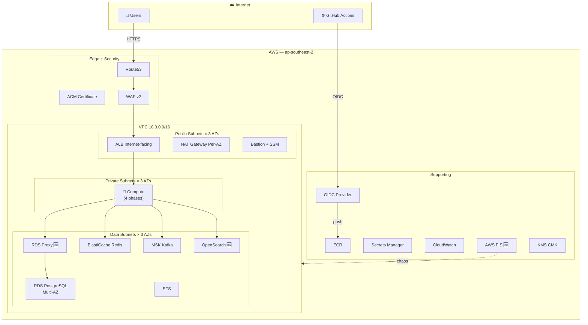
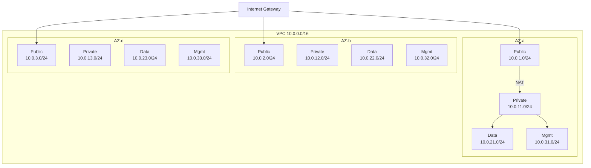
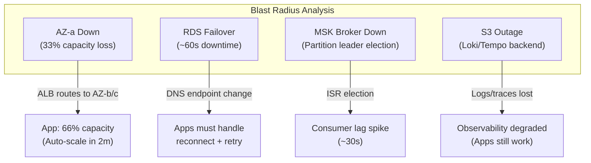
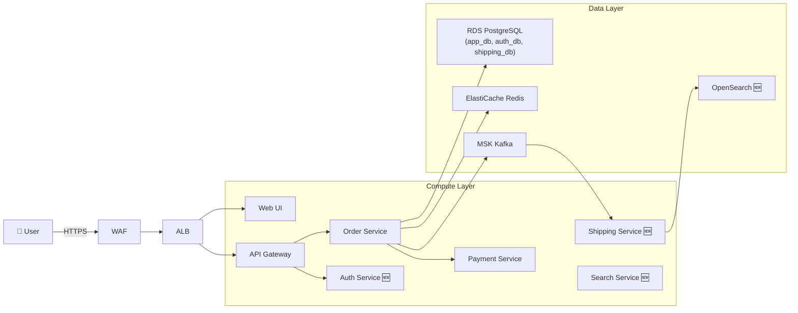
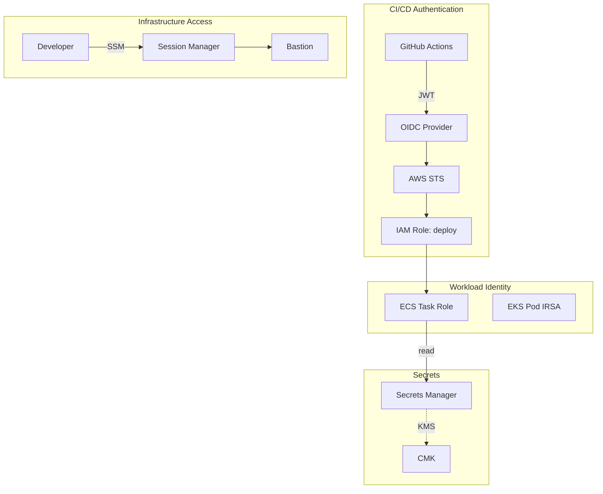
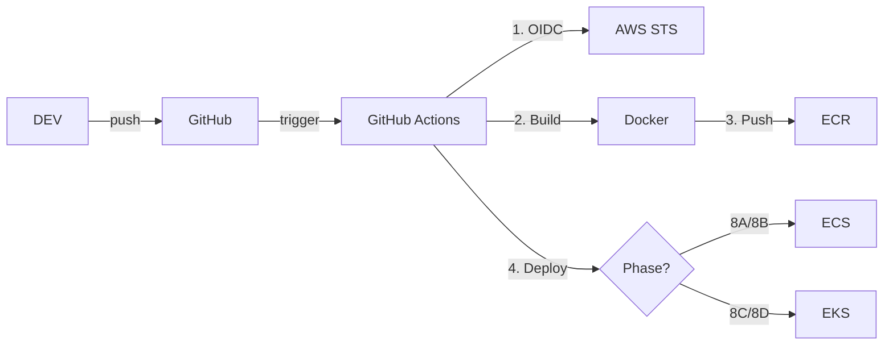

# 🏗️ AWS Architecture — Observability Lab

> **Blueprint của hệ thống trên AWS** — tập trung vào **Failure Domains**, **Blast Radius**, và **Trade-offs** so với On-Premises.

---

## 1. Service Mapping (On-Prem → AWS)

🆕 **Section mới** — giải thích "WHY" đằng sau mỗi quyết định.

| On-Prem (Docker Compose) | AWS Service | Why? | Trade-off / Learning |
|--------------------------|-------------|------|----------------------|
| PostgreSQL container | **RDS Multi-AZ** | Auto failover, backup, patching | Mất quyền tune `postgresql.conf`, cost cao hơn 3x |
| Redis container | **ElastiCache Replication Group** | Auto-failover < 30s | Không thể dùng Redis modules |
| Kafka KRaft single broker | **MSK (Managed Kafka)** | Không phải lo JVM tuning, partition rebalance | **$5/ngày** — phải destroy khi không dùng |
| PgBouncer (planned) | **RDS Proxy** 🆕 | Connection multiplexing, failover transparent | $0.015/conn-hour, chỉ support PostgreSQL/MySQL |
| MinIO (S3-compatible) | **Amazon S3 + Lifecycle** | 11 nines durability, Intelligent-Tiering | Data transfer cost khi cross-region |
| OpenSearch (planned) | **Amazon OpenSearch Service** 🆕 | Managed search, auto-scaling | ~$30/tháng cho t3.small × 2 |
| Grafana/Prometheus self-host | **AMP + AMG** (optional) | Managed, không phải scale storage | Mất quyền customize Prometheus rules |
| Local chaos (`docker stop`) | **AWS FIS** 🆕 | AZ failure, network partition, S3 outage | Cần IAM permissions cẩn thận |
| Docker secrets | **Secrets Manager + KMS** | Auto rotation, audit trail | $0.40/secret/month + API calls |

---

## 2. Production-Grade Architecture (Target)

```mermaid
graph TB
    subgraph INTERNET["☁️ Internet"]
        USER["👤 Users"]
        GHA["⚙️ GitHub Actions"]
    end

    subgraph AWS["AWS — ap-southeast-2"]
        subgraph EDGE["Edge + Security"]
            R53["Route53"]
            ACM["ACM Certificate"]
            WAF["WAF v2"]
        end

        subgraph VPC["VPC 10.0.0.0/16"]
            subgraph PUB["Public Subnets × 3 AZs"]
                ALB["ALB Internet-facing"]
                NAT["NAT Gateway Per-AZ"]
                BAST["Bastion + SSM"]
            end

            subgraph PRIV["Private Subnets × 3 AZs"]
                COMPUTE["🔄 Compute<br/>(4 phases)"]
            end

            subgraph DATA["Data Subnets × 3 AZs"]
                RDS["RDS PostgreSQL<br/>Multi-AZ"]
                RDS_PROXY["RDS Proxy 🆕"]
                REDIS["ElastiCache Redis"]
                MSK["MSK Kafka"]
                OS["OpenSearch 🆕"]
                EFS["EFS"]
            end
        end

        subgraph SUPPORT["Supporting"]
            ECR["ECR"]
            SM["Secrets Manager"]
            CW["CloudWatch"]
            FIS["AWS FIS 🆕"]
            OIDC["OIDC Provider"]
            KMS["KMS CMK"]
        end
    end

    USER -->|HTTPS| R53 --> WAF --> ALB --> COMPUTE
    COMPUTE --> RDS_PROXY --> RDS
    COMPUTE --> REDIS
    COMPUTE --> MSK
    COMPUTE --> OS
    GHA -->|OIDC| OIDC
    OIDC -->|push| ECR
    FIS -.->|chaos| VPC
```

---

## 3. Network Topology — 3 AZs × 4 Tiers

```mermaid
graph TB
    IGW["Internet Gateway"]

    subgraph VPC["VPC 10.0.0.0/16"]
        subgraph AZ_A["AZ-a"]
            PUB_A["Public<br/>10.0.1.0/24"]
            PRIV_A["Private<br/>10.0.11.0/24"]
            DATA_A["Data<br/>10.0.21.0/24"]
            MGMT_A["Mgmt<br/>10.0.31.0/24"]
        end

        subgraph AZ_B["AZ-b"]
            PUB_B["Public<br/>10.0.2.0/24"]
            PRIV_B["Private<br/>10.0.12.0/24"]
            DATA_B["Data<br/>10.0.22.0/24"]
            MGMT_B["Mgmt<br/>10.0.32.0/24"]
        end

        subgraph AZ_C["AZ-c"]
            PUB_C["Public<br/>10.0.3.0/24"]
            PRIV_C["Private<br/>10.0.13.0/24"]
            DATA_C["Data<br/>10.0.23.0/24"]
            MGMT_C["Mgmt<br/>10.0.33.0/24"]
        end
    end

    IGW --> PUB_A & PUB_B & PUB_C
    PUB_A -->|NAT| PRIV_A
    PRIV_A --> DATA_A
    PRIV_A --> MGMT_A
```

---

## 4. Failure Domains & Blast Radius 🆕

🆕 **Section mới** — Critical cho SRE mindset.

```mermaid
graph TB
    subgraph "Blast Radius Analysis"
        AZ_A_FAIL["AZ-a Down<br/>(33% capacity loss)"]
        RDS_FAILOVER["RDS Failover<br/>(~60s downtime)"]
        MSK_BROKER["MSK Broker Down<br/>(Partition leader election)"]
        S3_OUTAGE["S3 Outage<br/>(Loki/Tempo backend)"]
    end

    AZ_A_FAIL -->|"ALB routes to AZ-b/c"| APP_HEALTHY["App: 66% capacity<br/>(Auto-scale in 2m)"]
    RDS_FAILOVER -->|"DNS endpoint change"| APP_RECONNECT["Apps must handle<br/>reconnect + retry"]
    MSK_BROKER -->|"ISR election"| KAFKA_LAG["Consumer lag spike<br/>(~30s)"]
    S3_OUTAGE -->|"Logs/traces lost"| OBS_DEGRADED["Observability degraded<br/>(Apps still work)"]
```

**Blast Radius Matrix:**

| Failure | Impact | MTTD | MTTR | Mitigation |
|---------|--------|------|------|------------|
| AZ-a down | 33% capacity loss | < 1 min | 2-5 min (auto-scale) | Multi-AZ deployment |
| RDS failover | ~60s write downtime | < 1 min | 1-2 min | RDS Proxy transparent failover |
| MSK broker down | Kafka lag spike | < 1 min | 30s (leader election) | Replication factor 3 |
| NAT Gateway down | Outbound traffic lost | < 1 min | 5 min | NAT HA per-AZ |
| S3 outage | Logs/traces lost | < 1 min | N/A (AWS issue) | Local buffering in OTel |
| OpenSearch down | Search degraded | < 1 min | 5 min | Fallback to PostgreSQL |

---

## 5. Swappable Compute Layer — 4 Phases

### Decision Matrix 🆕

| Use Case | Recommended Phase | Why? |
|----------|------------------|------|
| Learning EC2 internals, ASG | 8A (ECS on EC2) | Understand capacity providers |
| Production workloads, minimal ops | 8B (ECS Fargate) | No patching, per-task billing |
| Complex apps, Helm charts | 8C (EKS Node Group) | K8s ecosystem, DaemonSets |
| Bursty workloads, fast scaling | 8D (EKS Fargate) | 1:1 pod isolation, but $ |
| Observability stack | Always 8C | DaemonSets need EC2 for host metrics |

### Phase Comparison

| Aspect | 8A (ECS EC2) | 8B (ECS Fargate) | 8C (EKS Node) | 8D (EKS Fargate) |
|--------|-------------|-----------------|--------------|-----------------|
| EC2 management | Bạn | AWS | Bạn | AWS (apps) |
| Cold start | Instant | ~30s | Instant | ~30s |
| Cost model | Per instance | Per task | Per instance | Per pod |
| Storage | EBS | EFS | EBS + PVC | EFS |
| DaemonSets | ✅ | ❌ | ✅ | ⚠️ (limited) |
| Learning value | EC2, ASG | Serverless | K8s core | Fargate profiles |

---

## 6. Application Data Flow

```mermaid
graph LR
    USER["👤 User"] -->|HTTPS| WAF --> ALB

    subgraph COMPUTE["Compute Layer"]
        UI["Web UI"]
        GW["API Gateway"]
        OS["Order Service"]
        PS["Payment Service"]
        AUTH["Auth Service 🆕"]
        SS["Shipping Service 🆕"]
        SEARCH["Search Service 🆕"]
    end

    subgraph DATA["Data Layer"]
        PG["RDS PostgreSQL<br/>(app_db, auth_db, shipping_db)"]
        RD["ElastiCache Redis"]
        KF["MSK Kafka"]
        OS2["OpenSearch 🆕"]
    end

    ALB --> UI & GW
    GW --> AUTH
    GW --> OS
    OS --> PS
    OS --> PG & RD & KF
    KF --> SS
    SS --> OS2
```

---

## 7. Security & Access Flow (Zero Trust)

```mermaid
graph TB
    subgraph AUTH["CI/CD Authentication"]
        GHA["GitHub Actions"] -->|JWT| OIDC["OIDC Provider"]
        OIDC --> STS["AWS STS"]
        STS --> IAM_DEP["IAM Role: deploy"]
    end

    subgraph ACCESS["Infrastructure Access"]
        DEV["Developer"] -->|SSM| SSM["Session Manager"]
        SSM --> BAST["Bastion"]
    end

    subgraph WORKLOAD["Workload Identity"]
        ECS_TASK["ECS Task Role"]
        EKS_IRSA["EKS Pod IRSA"]
    end

    subgraph SECRETS["Secrets"]
        SM["Secrets Manager"] -.->|KMS| KMS["CMK"]
    end

    IAM_DEP --> ECS_TASK
    ECS_TASK -->|read| SM
```

**Zero Trust Principles:**

- No long-lived credentials — OIDC only
- Least privilege — IAM roles scoped to specific resources
- No SSH keys — SSM Session Manager
- Encryption everywhere — KMS CMK for all data stores
- Network isolation — Private subnets, Security Groups, NACLs

---

## 8. CI/CD Pipeline

```mermaid
graph LR
    DEV -->|push| GH["GitHub"]
    GH -->|trigger| WF["GitHub Actions"]
    WF -->|1. OIDC| STS["AWS STS"]
    WF -->|2. Build| IMG["Docker"]
    IMG -->|3. Push| ECR["ECR"]
    WF -->|4. Deploy| DEPLOY{Phase?}
    DEPLOY -->|8A/8B| ECS["ECS"]
    DEPLOY -->|8C/8D| EKS["EKS"]
```

---

## 9. Observability (Dual-Stack) 🆕

| Signal | Self-hosted (Grafana Stack) | AWS-native |
|--------|---------------------------|-----------|
| App metrics | Prometheus (OTel) | CloudWatch Metrics |
| App logs | Loki (JSON) | CloudWatch Logs |
| Traces | Tempo (OTel) | X-Ray |
| Dashboards | Grafana | CloudWatch Dashboards |
| Infra metrics | Node Exporter | Container Insights |
| DB performance | — | RDS Performance Insights |
| Alerting | Alertmanager → Telegram | CloudWatch Alarms → SNS |

> **Learning Value:** So sánh pros/cons giữa self-hosted vs managed observability.

---

## 10. Missing Components (To-Be) 🆕

| Component | Purpose | Priority |
|-----------|---------|---------|
| RDS Proxy | Connection pooling, failover transparency | P1 |
| OpenSearch | Search Service backend (EXPANSION_PLAN) | P1 |
| AWS FIS | Chaos Engineering (AZ failure, network partition) | P1 |
| Step Functions | Compare với self-hosted Saga Orchestrator | P2 |
| AWS WAF | Edge security (SQLi, XSS, rate limit) | P2 |
| AWS Config | Compliance auditing | P3 |

---

## Quick Reference

| Layer | Components | Subnet | Production Additions |
|-------|-----------|--------|---------------------|
| Edge | Route53, ACM, ALB, WAF | Public | WAF v2, Rate Limiting |
| Compute | ECS/EKS (4 phases) | Private | Auto-scaling, Health checks |
| Data | RDS, Redis, MSK, EFS, OpenSearch | Data | Multi-AZ, Backup, KMS, TLS |
| Observability | Prometheus, Grafana, Loki, Tempo | Private | Dual-stack với CloudWatch |
| Management | Bastion, SSM | Mgmt | No SSH, Session Manager |
| CI/CD | OIDC, GitHub Actions | External | OIDC IAM roles |
| State | Terraform state | — | S3 Backend, Native Lockfile |
| Secrets | Secrets Manager, SSM | — | Auto Rotation, KMS |