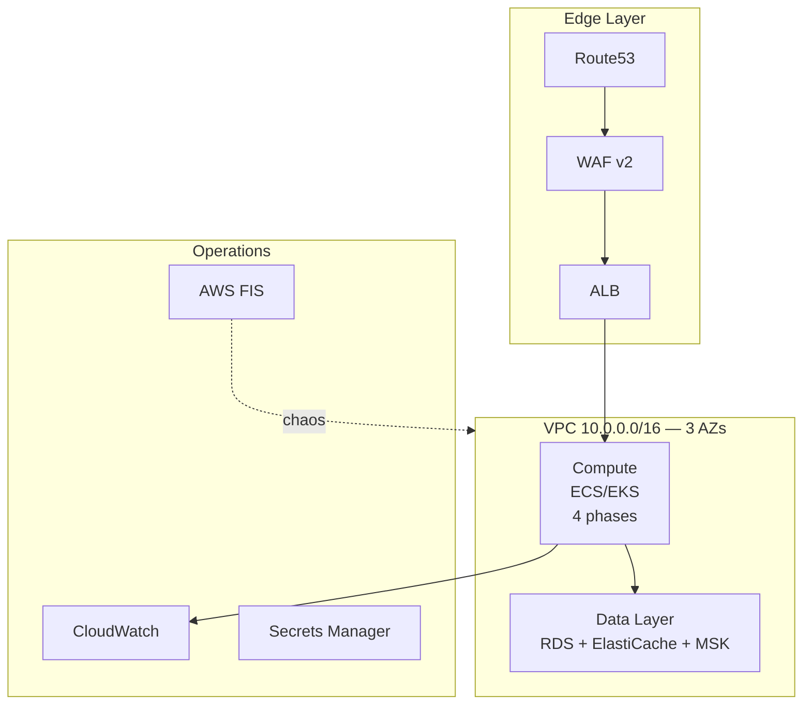

# ☁️ AWS Reliability Lab — Production-Grade Cloud Engineering Sandbox

> **Không phải "bấm nút deploy lên cloud".** Đây là phòng thí nghiệm so sánh (Comparative Reliability Lab) giữa On-Premises Docker Compose và AWS Cloud-Native, được thiết kế để rèn luyện tư duy của **Staff/Principal SRE & Cloud Architect**.

🔗 **Cross-Reference:** [On-Premises Baseline](../on-premises/README.md) | [Expansion Roadmap](../on-premises/EXPANSION_PLAN.md)

---

## 🎯 Learning Objectives (Mục tiêu học tập)

Sau khi hoàn thành lab này, bạn sẽ có khả năng:

| # | Kỹ năng | Mức độ thành thạo |
|---|---------|-------------------|
| 1 | **Network Design** — Thiết kế VPC Multi-AZ với Blast Radius isolation | ⭐⭐⭐⭐⭐ |
| 2 | **Compute Strategy** — So sánh ECS vs EKS qua 4 phases (8A-8D) | ⭐⭐⭐⭐⭐ |
| 3 | **Managed Services** — Vận hành RDS, ElastiCache, MSK ở production-grade | ⭐⭐⭐⭐ |
| 4 | **IaC Mastery** — Modular Terraform + OPA policy-as-code | ⭐⭐⭐⭐⭐ |
| 5 | **Security** — Zero Trust với IAM Roles, OIDC, KMS, SSM | ⭐⭐⭐⭐ |
| 6 | **DR Strategy** — Pilot Light với RTO < 15 phút | ⭐⭐⭐ |
| 7 | **FinOps** — Tối ưu AWS bill, giảm 50-70% chi phí lab | ⭐⭐⭐⭐ |
| 8 | **Chaos Engineering** — AWS FIS cho AZ failure, network partition | ⭐⭐⭐⭐ |
| 9 | **GitOps CI/CD** — GitHub Actions + OIDC + ECR + ECS/EKS | ⭐⭐⭐⭐ |

---
### 🧠 Architectural Philosophy & Design Decisions
| Decision | Rationale & Learning Value |
|---|---|
| **ECS-First Approach** | Dù EKS rất phổ biến, **ECS** vẫn là "workhorse" cho ~70% workload enterprise/SMB do operational overhead thấp hơn. Lab này master ECS (EC2 & Fargate launch types, Capacity Providers) trước để hiểu bản chất container orchestration trước khi tackle K8s control plane. |
| **Hybrid CI/CD Strategy** | **CI** luôn là GitHub Actions (Build, Test, Push ECR). **CD** phụ thuộc ngữ cảnh: **Push-based** (GHA + AWS CLI/Terraform) cho ECS để hiểu imperative deployment, và **Pull-based GitOps** (ArgoCD) khi chuyển sang EKS để master declarative state reconciliation. |
| **Dual Terraform Backends** | `shared/` dùng **S3 + DynamoDB** (AWS native, fine-grained IAM, KMS). `dev/` dùng **Terraform Cloud** (VCS integration, remote ops, team RBAC). Sự phân tách này giúp so sánh trade-offs giữa Self-managed vs SaaS state management dựa trên team size. |
| **OTel-Native Observability** | App code chỉ emit OTLP (Vendor-neutral). AWS Managed Services (AMP, X-Ray, CloudWatch) làm backend. Tách biệt "Telemetry Generation" và "Storage" để chống vendor lock-in ở tầng application. |
---

## 🗺️ How to Navigate (Dành cho người mới)

| Nếu bạn là... | Đọc theo thứ tự | Mục tiêu |
|---------------|-----------------|----------|
| **SRE mới vào team** | README → ARCHITECTURE → PLAYBOOK → Runbooks | Hiểu hệ thống trước khi on-call |
| **Platform Engineer** | PLAYBOOK → `policy/` → CI/CD pipeline | Deploy & vận hành IaC |
| **Principal/Staff** | README → TRADE_OFFS → FinOps → Post-Mortems | Đánh giá architecture & cost |
| **Interview Prep** | README → `devops-question-m*.md` | Ôn tập trước phỏng vấn |

---

## 🏗️ Architecture Overview



👉 Xem chi tiết: `ARCHITECTURE_AWS.md`

---
### 🔭 Observability Strategy: The "OTel-Native" Bridge
Để tối ưu hóa việc học production-grade mà không "reinvent the wheel", chúng ta áp dụng pattern **Vendor-Neutral Code, Cloud-Native Backends**:
*   **Instrumentation:** 100% OpenTelemetry (OTLP). App code không hardcode AWS SDK.
*   **Pipeline:** AWS Distro for OpenTelemetry (ADOT) deploy dưới dạng ECS Sidecar hoặc EKS DaemonSet.
*   **Backends:**
    *   **Metrics ➡️ Amazon Managed Prometheus (AMP):** Học PromQL, Recording Rules, SigV4 auth mà không phải manage TSDB storage.
    *   **Logs ➡️ CloudWatch Logs:** (qua FireLens cho ECS / FluentBit cho EKS) Master CloudWatch Logs Insights & Live Tail.
    *   **Traces ➡️ AWS X-Ray:** Tận dụng Service Lens và Trace Groups cho distributed debugging.
*   **Visualization:** Amazon Managed Grafana (AMG) kết nối trực tiếp với AMP, CloudWatch, X-Ray qua IAM Roles.
---

## 📊 Progress Tracking

| Layer | Modules | Trạng thái |
|-------|---------|-----------|
| Foundation | `network`, `vpc-endpoints`, `security`, `logging-flow-logs` | ✅ Done |
| Data | `database` (RDS) | ✅ Done |
| Data | `cache` (ElastiCache), `streaming` (MSK) | 🔲 TODO |
| Data | `opensearch`, `rds-proxy` | 🆕 NEW — TODO |
| Platform | `ecr`, `efs`, `loadbalancer` | 🔲 TODO |
| Operations | `bastion`, `cicd`, `backup`, `budgets` | 🔲 TODO |
| Operations | `fis` (Chaos Engineering) | 🆕 NEW — TODO |
| Compute | `ecs-ec2`, `ecs-fargate`, `eks-nodegroup`, `eks-fargate` | 🔲 TODO |
| DR | Pilot Light (cross-region) | 🔲 TODO |

---

## ⚠️ Anti-Patterns (Những điều KHÔNG nên làm)

| ❌ Anti-Pattern | ✅ Best Practice | Why? |
|----------------|----------------|------|
| Dùng default VPC cho production | Tạo VPC riêng với private subnets | Blast radius control |
| Hardcode AWS Access Keys trong GitHub Actions | Dùng OIDC | Security — no long-lived credentials |
| Deploy single-AZ RDS cho Order Service | Multi-AZ RDS | Avoid single point of failure |
| Bỏ qua VPC Endpoints | Tạo Gateway (S3, DDB) + Interface endpoints | Data transfer cost qua NAT sẽ x5 bill |
| Không tag resources | Tag chuẩn: `Project`, `Environment`, `Owner`, `CostCenter` | Không thể allocate cost |
| Deploy MSK 24/7 khi không dùng | Destroy khi lab xong | MSK tốn ~$5/ngày |
| ClickOps (bấm console) | 100% Terraform | Reproducibility & auditability |
| Dùng EC2 SSH trực tiếp | SSM Session Manager qua Bastion | No open port 22 |

---

## 🆚 What's Different from On-Prem?

| Aspect | On-Prem (Docker Compose) | AWS (Terraform) |
|--------|--------------------------|----------------|
| Network | Single bridge network | VPC + Subnets + NAT + SGs + NACLs |
| Compute | `docker compose up` | ECS/EKS + ASG + Capacity Providers |
| Database | PostgreSQL container | RDS Multi-AZ + RDS Proxy |
| Cache | Redis container | ElastiCache Replication Group |
| Streaming | Kafka KRaft single broker | MSK Cluster (Multi-AZ) |
| Secrets | `.env` files | Secrets Manager + KMS |
| CI/CD Auth | N/A | OIDC + IAM Roles |
| Chaos | `docker stop <container>` | AWS FIS (AZ failure, network partition) |
| DR | Backup files | Cross-region RDS replica + Route53 failover |
| Cost | Fixed (hardware) | Variable ($/hour) — FinOps critical |

---

## ⚡ Quick Start

**Prerequisites:**

- Terraform ≥ 1.7.0
- AWS CLI configured (`aws configure`)
- S3 backend bootstrapped (xem `bootstrap/`)
> ⚠️ **State Management Note (Dual-Backend Setup):**
> *   **Shared Infra (Network, DB, Security):** Sử dụng `S3 + DynamoDB`. Bạn **BẮT BUỘC** phải chạy module `bootstrap/` trước để tạo S3 bucket, DynamoDB lock table và KMS key.
> *   **Dev/Workloads:** Sử dụng `Terraform Cloud` (HCP Terraform). Bạn cần chạy `terraform login` và map workspace trên HCP dashboard trước khi `terraform init`.
> *   *Learning Goal:* So sánh UX, Security Model (IAM vs API Tokens) và Cost giữa AWS Native State và SaaS State.
- OPA + conftest installed

**Deploy shared infrastructure:**

```bash
cd environments/shared
terraform init
terraform plan -out=plan.tfplan
terraform show -json plan.tfplan > plan.json
conftest test plan.json -p ../../policy/  # Validate OPA policies
terraform apply plan.tfplan
```

**Destroy:**

```bash
cd environments/shared
terraform destroy
```

> 💡 **FinOps Tip:** `terraform destroy` → $0/day. Apply sáng, destroy tối ≈ $10/ngày.

---

## 📚 Documentation Structure

```
terraform/
├── README.md                          ← File này (Front Door)
├── ARCHITECTURE_AWS.md                ← Blueprint & Failure Domains
├── AWS_TERRAFORM_PLAYBOOK.md          ← 🆕 Module-by-module playbook
├── TRADE_OFFS.md                      ← 🆕 Decision records (why AWS services?)
├── FINOPS.md                          ← 🆕 Cost management & optimization
├── LEARNING_PATH.md                   ← 🆕 6-week curriculum
│
├── modules/                           ← Reusable Terraform modules
├── environments/                      ← Per-environment configs
├── policy/                            ← OPA/Rego policy-as-code
├── drills/                            ← 🆕 AWS FIS chaos scenarios
├── runbooks/                          ← 🆕 AWS-specific runbooks
└── interviews/                        ← DevOps interview questions
```

---

## 📝 DevOps Interview Practice

| File | Level | Số câu | Focus |
|------|-------|--------|-------|
| `devops-question-m1-iac-core.md` | Junior–Senior | 54 | Terraform, state, modules |
| `devops-question-m2-networking-security.md` | 🆕 Mid–Senior | ~40 | VPC, IAM, KMS, OPA |
| `devops-question-m3-dr-backup.md` | 🆕 Senior | ~30 | RPO/RTO, vault lock, compliance |
| `devops-question-m4-finops.md` | 🆕 Senior | ~25 | Cost optimization, pricing models |
| `devops-question-m5-chaos.md` | 🆕 Senior | ~25 | AWS FIS, failure injection |

---

## 🤝 Contributing

Repository này là môi trường học tập mở. Nếu bạn phát hiện gap trong playbook, đề xuất chaos experiment mới, hoặc muốn chia sẻ post-mortem từ lab của bạn, hãy mở Issue hoặc PR.

---

> 🛡️ *"Reliability is the most important feature. If users can't access the system, nothing else matters."* — Google SRE Book