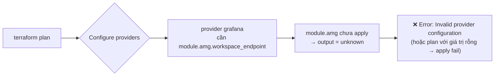

# 🐔🥚 Grafana Provider Bootstrap — Chicken-and-Egg Problem

*Tài liệu kỹ thuật giải thích vấn đề circular dependency giữa `provider "grafana"` và `module.amg`, kèm 2 hướng giải quyết: 2-phase apply (ngắn hạn) và tách state (khuyến nghị production).*

---

## 📍 Vấn đề

[control-plane/lab/amg.tf](../control-plane/lab/amg.tf) khai báo `provider "grafana"` ngay trong cùng root module với `module.amg`:

```hcl
module "amg" {
  source = "../../modules/observability/amg"
  # ...
}

provider "grafana" {
  url  = "https://${module.amg.workspace_endpoint}"   # ← output của module.amg
  auth = module.amg.service_account_token              # ← output của module.amg
}

resource "grafana_data_source" "prometheus" {
  # ... dùng provider "grafana" ở trên
}
```

**Vấn đề cốt lõi:** Terraform cần **cấu hình xong toàn bộ provider blocks** (bao gồm resolve giá trị `url`/`auth`) **trước khi** build dependency graph để plan bất kỳ resource nào — kể cả resource không thuộc provider đó. Nhưng `url` và `auth` lại phụ thuộc vào output của `module.amg`, output này chỉ có **sau khi** `aws_grafana_workspace` + `aws_grafana_workspace_service_account_token` được apply.



### Triệu chứng thực tế khi chạy `terraform apply` lần đầu (workspace mới, chưa có state)

```
│ Error: Invalid provider configuration
│
│ Provider "registry.terraform.io/grafana/grafana" requires explicit
│ configuration. Add a provider block to the root module and configure
│ the provider's required arguments as described in the documentation.
```

Hoặc nếu Terraform "chấp nhận" plan với giá trị unknown, resource `grafana_data_source.*` sẽ fail ở bước apply với lỗi 401/connection refused vì `url`/`auth` rỗng.

---

## ✅ Giải pháp 1 (Ngắn hạn / Lab): 2-Phase Apply

Không thay đổi code — chỉ thay đổi **quy trình apply**. Dùng `-target` để buộc Terraform tạo xong AMG workspace + token trước, sau đó apply toàn bộ.

### Quy trình

```bash
cd terraform/control-plane/lab

# Phase 1: Chỉ tạo AMG workspace + IAM role + service account token
# (module.amg không phụ thuộc gì từ grafana provider nên apply được ngay)
terraform apply -target=module.amg

# Phase 2: Apply toàn bộ — lúc này module.amg đã có output thật,
# provider "grafana" configure thành công, grafana_data_source.* apply được
terraform apply
```

### Khi nào phải lặp lại Phase 1?

- Lần đầu tạo workspace mới (`terraform init` mới, state trống).
- Sau khi `terraform destroy` toàn bộ rồi tạo lại.
- Sau khi **xóa thủ công** `aws_grafana_workspace` hoặc `aws_grafana_workspace_service_account_token` khỏi state (`terraform state rm`).

Trong CI/CD pipeline, bước "Phase 1" nên được thêm như một **pre-apply step riêng** (không phải `terraform plan` chung), vì `-target` luôn tạo ra một partial plan gây warning trong CI nếu không handle rõ ràng:

```yaml
# Ví dụ GitHub Actions step (minh họa — pipeline thật ở Phase 3 ROADMAP)
- name: Bootstrap AMG workspace (idempotent — no-op nếu đã tồn tại)
  run: terraform apply -target=module.amg -auto-approve
  continue-on-error: true   # workspace đã tồn tại → apply -target là no-op, không lỗi

- name: Full apply
  run: terraform apply -auto-approve
```

### Trade-offs

| Ưu điểm | Nhược điểm |
|---|---|
| Không cần thay đổi cấu trúc code/state | Vi phạm nguyên tắc "1 lệnh apply duy nhất" của IaC — dễ quên bước Phase 1 khi teammate mới join |
| Áp dụng được ngay, không cần thêm backend config | `-target` che khuất một phần dependency graph thật — rủi ro drift nếu dùng lặp lại nhiều lần |
| Phù hợp cho Lab/Dev — tốc độ ưu tiên hơn structure | Không scale tốt khi nhiều người cùng apply — dễ conflict thứ tự |

---

## 🏗️ Giải pháp 2 (Khuyến nghị Production): Tách State

Root cause thật sự là **`module.amg` (hạ tầng AWS) và `grafana_data_source.*` (cấu hình bên trong Grafana) đang sống chung 1 state/1 root module**, dù chúng thuộc 2 "tốc độ thay đổi" khác nhau và có quan hệ phụ thuộc một chiều rõ ràng (data source **luôn** cần workspace tồn tại trước).

### Kiến trúc đề xuất

```
control-plane/lab/                     ← State hiện tại: VPC, IAM, RDS, ECS Cluster, AMP, AMG (workspace only)
    amg.tf                             ← CHỈ còn module "amg" (bỏ toàn bộ provider "grafana" + grafana_data_source.*)

control-plane/lab-grafana-datasources/ ← State MỚI: chỉ chứa Grafana data source config
    main.tf                            ← đọc AMG endpoint qua terraform_remote_state
    providers.tf                       ← provider "grafana" (an toàn vì remote_state đã apply xong)
```

### `control-plane/lab-grafana-datasources/providers.tf`

```hcl
data "terraform_remote_state" "control_plane" {
  backend = "s3"
  config = {
    bucket = "obs-terraform-state-730335245469"
    key    = "control-plane/lab/terraform.tfstate"
    region = "ap-southeast-2"
  }
}

provider "grafana" {
  url  = "https://${data.terraform_remote_state.control_plane.outputs.amg_workspace_endpoint}"
  auth = data.terraform_remote_state.control_plane.outputs.amg_service_account_token
}
```

> ⚠️ Lưu ý: `service_account_token` phải được `sensitive = true` ở output ([đã áp dụng](../modules/observability/amg/outputs.tf)), nhưng **remote_state output vẫn đọc được giá trị plaintext** nếu principal có quyền `s3:GetObject` trên state bucket. Xem thêm mục "Rủi ro còn lại" bên dưới.

### `control-plane/lab-grafana-datasources/main.tf`

```hcl
resource "grafana_data_source" "prometheus" {
  type       = "prometheus"
  name       = "Amazon Managed Prometheus"
  uid        = "amp-datasource"
  is_default = true

  url                = data.terraform_remote_state.control_plane.outputs.amp_prometheus_endpoint
  basic_auth_enabled = false

  json_data_encoded = jsonencode({
    httpMethod    = "POST"
    sigV4Auth     = true
    sigV4AuthType = "workspace-iam-role"
    sigV4Region   = var.aws_region
    timeInterval  = "15s"
  })
}

# ... xray, cloudwatch data sources tương tự
```

### Quy trình apply (không còn 2-phase thủ công)

```bash
# 1. Apply control-plane (AMG workspace được tạo xong, output có giá trị thật)
cd terraform/control-plane/lab
terraform apply

# 2. Apply grafana-datasources (đọc remote state đã "chín" — không còn unknown)
cd ../lab-grafana-datasources
terraform apply
```

Đây **vẫn là 2 lệnh apply**, nhưng khác biệt cốt lõi so với Giải pháp 1:
- Không dùng `-target` (partial plan) — mỗi state tự plan đầy đủ dependency graph của nó.
- Ranh giới rõ ràng theo **tốc độ thay đổi**: AMG workspace hiếm khi đổi (tháng/quý), data source config có thể đổi thường xuyên hơn (thêm dashboard, đổi data source mới) — tách state giúp blast radius nhỏ hơn khi apply nhầm.
- Đúng nguyên tắc *Control Plane vs Data Plane Boundary* đã định nghĩa trong [ROADMAP.md](../ROADMAP.md) — coi `grafana_data_source` như một "Data Plane" nhỏ của riêng AMG.

### Trade-offs

| Ưu điểm | Nhược điểm |
|---|---|
| Không còn circular dependency — mỗi state tự đủ điều kiện apply | Thêm 1 state file, 1 backend key, 1 thư mục cần maintain |
| Blast radius nhỏ: sửa dashboard data source không đụng tới VPC/IAM/RDS state | Cross-state dependency qua `terraform_remote_state` — cần đồng bộ output contract cẩn thận (giống nguyên tắc SSM Service Catalog đã dùng cho Data Plane) |
| Dễ áp dụng CI/CD riêng cho từng state (khác tốc độ approve) | Cần thêm quyền IAM `s3:GetObject` lên state bucket cho pipeline chạy `lab-grafana-datasources` |

---

## 🔐 Rủi ro còn lại (cả 2 giải pháp)

`aws_grafana_workspace_service_account_token` là **admin token dạng plaintext trong Terraform state** (dù output có `sensitive = true`, giá trị vẫn nằm trong state file, chỉ bị che khi hiển thị ở CLI/UI).

- **Đã có sẵn:** [backend.tf](../control-plane/lab/backend.tf) dùng S3 + KMS CMK encryption at-rest — giảm rủi ro lộ token nếu bucket bị truy cập trái phép.
- **Chưa có:** giới hạn quyền đọc state ở cấp IAM policy (ai có quyền `s3:GetObject` vào state bucket = có full admin Grafana). Production nên:
  1. Tạo IAM policy riêng chỉ cho phép CI/CD role đọc `control-plane/lab/terraform.tfstate` (không cho user cá nhân đọc trực tiếp).
  2. Cân nhắc không dùng Service Account Token cho Grafana Provider — thay vào đó cấu hình data source qua AWS Console/API 1 lần (out-of-band), Terraform chỉ quản lý `aws_grafana_workspace` (infra), không quản lý `grafana_data_source` (config bên trong).

---

## 📋 Khuyến nghị

| Môi trường | Giải pháp |
|---|---|
| **Lab (hiện tại)** | Giải pháp 1 (2-phase apply với `-target=module.amg`) — đơn giản, tốc độ ưu tiên |
| **Production (Phase 3 — PR-Driven IaC)** | Giải pháp 2 (tách state) — bắt buộc trước khi đưa vào CI/CD pipeline, tránh `-target` trong pipeline tự động (anti-pattern, che khuất plan thật) |
